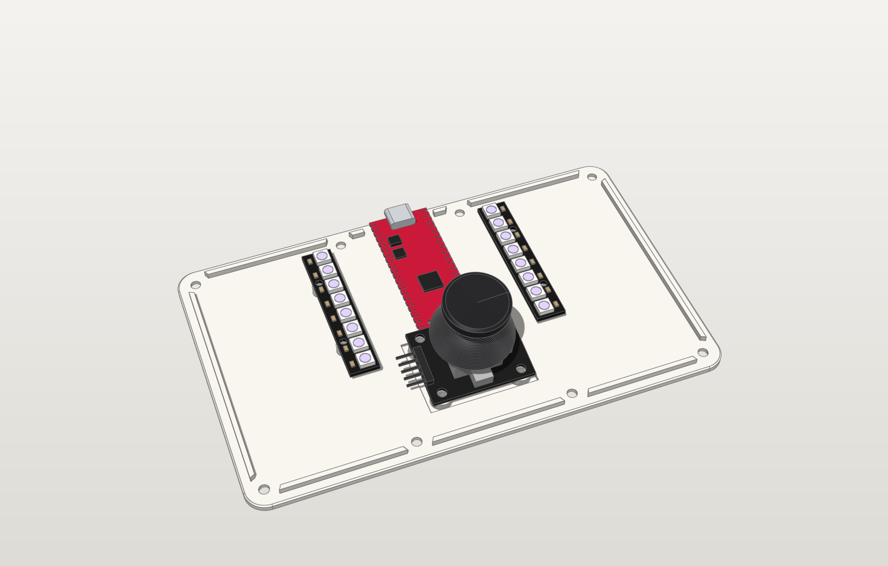
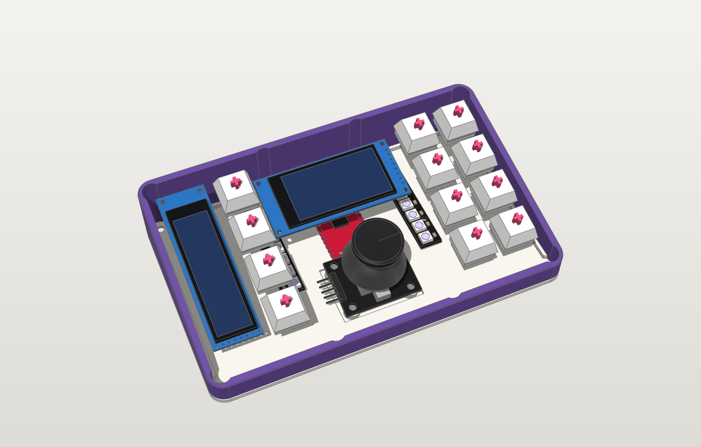
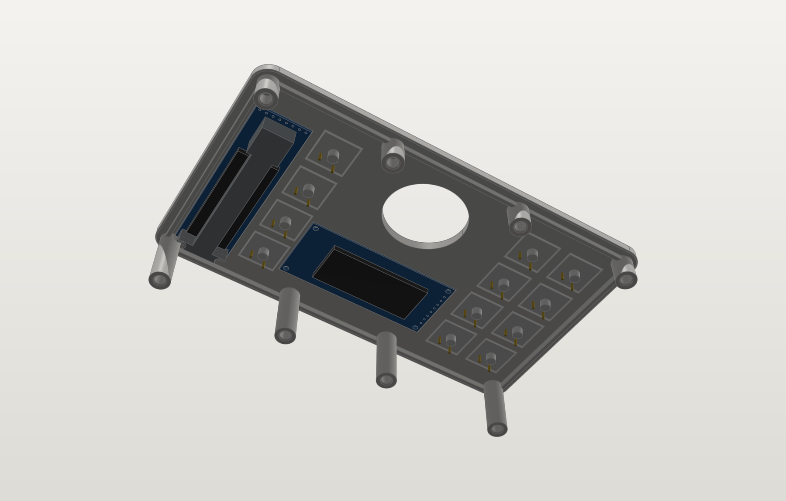
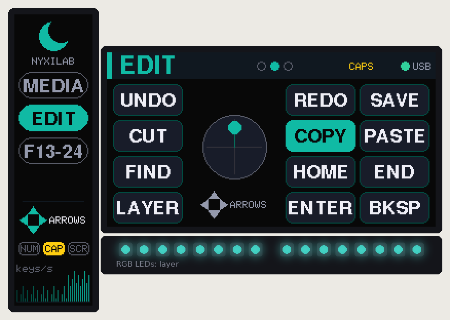
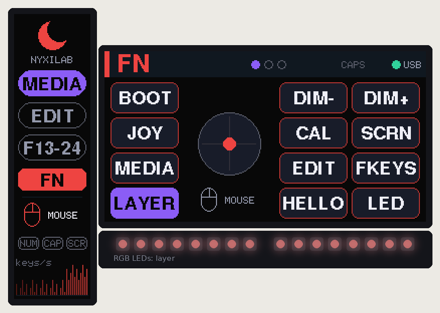
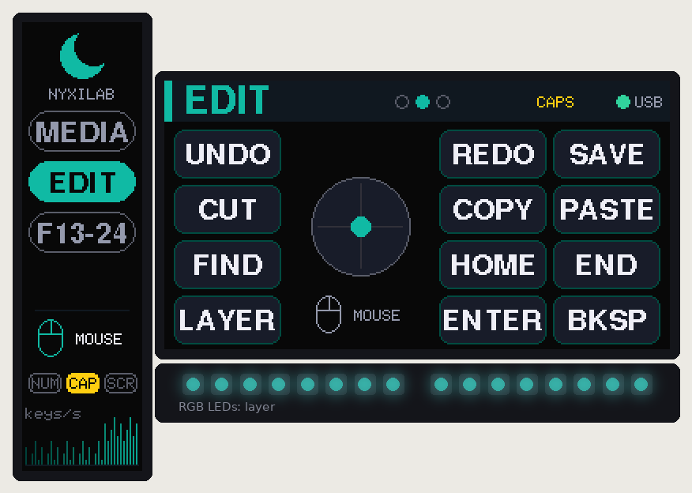
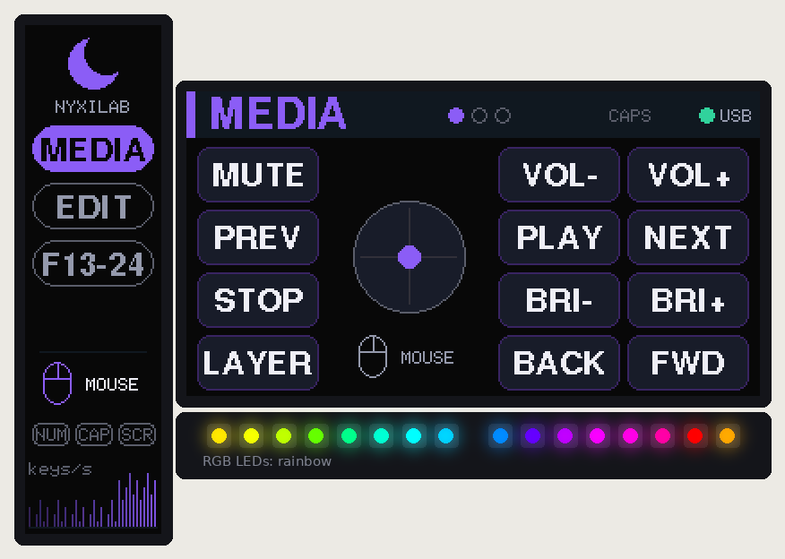
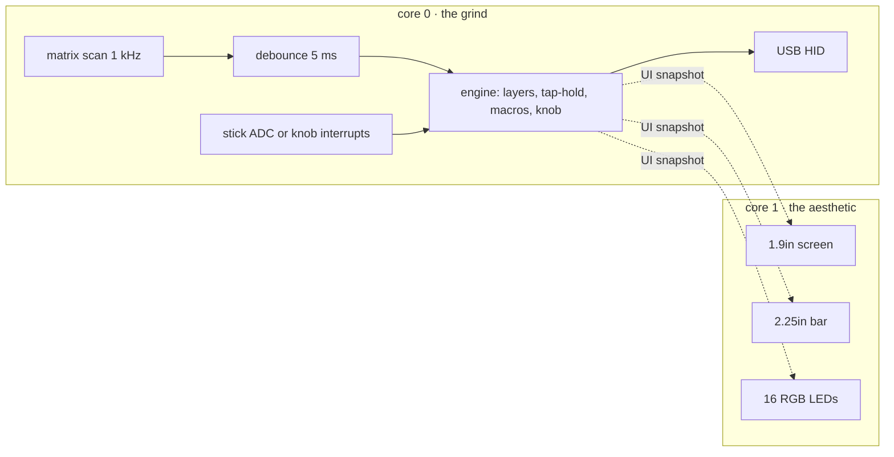

<div align="center">

# 🌙 nyxilab macropad

**12 keys. 2 screens. 16 LEDs. 1 stick *or* 1 knob. 0 glue.**
<br>it's giving main character desk energy 💅


**[📖 docs site](https://worxbend.github.io/macropad-nyxilab/) · [🧊 3D viewer](https://worxbend.github.io/macropad-nyxilab/viewer.html) · [⬇️ downloads](https://worxbend.github.io/macropad-nyxilab/downloads.html)**

</div>

## tl;dr 🫠

a hand-wired, 3D-printed macropad built around a **Raspberry Pi Pico 2**, with two color
displays, 16 RGB LEDs, and your pick of an analog thumbstick or a clicky rotary knob. this
monorepo has literally everything: the parametric case, print-ready files, blueprints,
a soldering guide with wiring maps, and the firmware. clone it, print it, solder it, flex it.
no custom PCB, no extra USB socket, no cap.

## choose your fighter 🎮

same case, same keys, same screens, same LEDs. only the thing in the middle changes,
and each edition is its own pair of projects.

| 🕹️ **joystick edition** | 🎛️ **rotary edition** |
|---|---|
|  |  |
| KY-023 thumbstick: mouse, scroll or arrow keys, per layer | KY-040 encoder + a chunky printed Ø30 knob: volume, undo/redo, scroll, zoom… |
| [`joystick/cad`](joystick/cad) · [`joystick/firmware`](joystick/firmware) | [`rotary/cad`](rotary/cad) · [`rotary/firmware`](rotary/firmware) |
| `nyxilab-macropad-joystick-pico2.uf2` | `nyxilab-macropad-rotary-pico2.uf2` |
| [read more →](joystick/README.md) | [read more →](rotary/README.md) |

the frame and the bar-display spine are literally the same parts in both, so switching
teams later means reprinting the top plate and the base. that's it.

## the specs (no cap) 📋

| | |
|---|---|
| ⌨️ **inputs** | 12 × MX switches (hand-wired matrix + diodes) and a KY-023 thumbstick that clicks **or** a KY-040 knob that clicks |
| 📺 **screens** | 1.9" 170×320 ST7789 IPS (main character) + 2.25" 76×284 ST7789P3 bar (the sidekick) |
| 💡 **lights** | 2 × 8 WS2812B LED sticks on the base, either side of the Pico: layer color, breathing or rainbow |
| 🧠 **brain** | Pico 2 (RP2350) USB-C clone, or the OG Pico (RP2040) if that's what you've got |
| 📐 **case** | 3-layer wedge: top plate, contrasting centre frame, base · 10° tilt · 159 × 98 mm · 18 → 35 mm tall |
| 🔩 **held together by** | 8 × M3×8 countersunk screws into heat-set inserts. zero glue, fully serviceable |
| ⚡ **firmware** | USB keyboard + media + mouse, layers, tap-hold, macros, joystick modes or per-layer knob bindings, LED effects |

## the lore 📜

every design decision had a reason, bestie. here's the tea:

- **three layers, two colors.** top plate + base in color A, the frame in color B, so you get
  that stripe all the way around. the screws pull the base and plate together *through* the frame,
  so the color seams close tight. no gaps, no drama.
- **print the frame translucent and the stripe glows.** the LED sticks sit on the base
  pointing up, so a clear or frosted PETG frame turns into a light band in your layer color.
  opaque frame? still works, just more subtle (the glow leaks around the stick).
- **all 8 screws are the same length.** the screw posts hang off the top plate, so the wedge
  doesn't make you buy three screw sizes. we love a consistent queen.
- **the Pico clone has no holes at the USB end** (rude). so the back wall thins down to 1.2 mm
  around the USB-C socket and holds it in place. any cable plugs in all the way. understood the assignment.
- **the joystick dome swings wider than you'd think** when you tilt it. posts hanging from the top
  plate would've been in the way, so the stick stands on tilted posts that grow out of the base.
- **the knob is panel-mounted like a real audio knob.** the encoder's M7 nut clamps the plate,
  a square pocket underneath stops it from spinning, and the printed knob's bore ends exactly at
  the shaft tip, so you just press it on until it stops. pressing it clicks the switch, not the knob
  down the shaft. an engraved ring frames it, because a sunken well would've printed as a 34 mm
  bridge on the pretty side. no thanks.
- **the bar display only has holes at one end.** a tiny printed clamp (`bar_spine`) holds the
  other end. no glue, no hot-glue era.

<div align="center">


<br><sub>cross-sections through the stick / the knob, the main screen, the Pico and the USB-C port. every mm accounted for 🧮</sub>
</div>

## glamour shots 📸

| exploded (it's a whole stack) | the knob era |
|---|---|
|  |  |
| **the base: Pico + LED sticks** | **the back (USB-C, centered, obviously)** |
|  |  |
| **what's inside** | **the underside of the plate** |
|  |  |

wanna spin it around yourself? **[open the 3D viewer](https://worxbend.github.io/macropad-nyxilab/viewer.html)**
(or `docs/viewer.html` offline): switch editions, orbit, explode the layers, slice it with a live
section plane, toggle parts. it's lowkey addictive.

## the screens are eating fr 📺

these are rendered by the **actual firmware code** running on your PC (`make ui-sim`), not a mockup.
the dots underneath are the 16 LEDs, as the firmware would light them. real ones know.

| MEDIA layer | EDIT layer, caps lock on | FN held |
|---|---|---|
|  |  |  |
| **knob: volume** | **knob: undo/redo** | **knob: zoom preset + rainbow** |
|  |  |  |

the 1.9" screen mirrors the physical key layout and lights up what you press. the middle
shows the stick, or a dial with 20 ticks that follows the knob and says what it does right
now. the bar shows your layers, the stick mode or knob function, NUM/CAPS/SCROLL straight
from your computer, and a keys-per-second graph so you can watch yourself go feral.

## soldering, but make it not scary 🔥

no PCB means you wire it yourself. the [soldering guide](docs/soldering.md) walks you through
it with pictures: how the matrix works, which way the diodes go, how the bent diode legs
*become* the row wires, and a wiring map drawn from the CAD model that shows where every
wire runs inside the case (plate seen from below, base from above).

| the diode, step by step | where the wires run |
|---|---|
|  |  |

## what's in the box 📦

four projects and the stuff they share:

```
joystick/
  cad/               the joystick edition's case: edition.py + build.py, exports/ (STL, 3MF, STEP, FreeCAD, GLB, blueprints)
  firmware/          its PlatformIO project: config.h, keymap.cpp, the stick, tests, dist/*.uf2
rotary/
  cad/               the rotary edition's case: the encoder mount + the knob, exports/
  firmware/          its PlatformIO project: config.h, keymap.cpp, the knob, tests, dist/*.uf2
common/
  cad/               the shared parametric case model (build123d) that both editions build on
  firmware/          the shared firmware libraries: engine, USB HID, displays, LEDs, the app loop (+ their tests)
docs/                design notes, printing, soldering, wiring, assembly, generated images, 3D viewer
tools/               UI simulator, wiring diagrams + maps, soldering figures, viewer + website builders
```

## speedrun any% 🏃‍♀️

1. **pick your edition** (joystick or rotary) and grab its files: `<edition>/cad/exports/` or the
   [downloads page](https://worxbend.github.io/macropad-nyxilab/downloads.html).
2. **print the fit tests first** (`3mf/fit-tests/`, ~1 h total). they check the switch
   cut-out, both display pockets, the USB-C port, the joystick posts or the encoder mount,
   and the LED-stick posts against *your* parts. rotary gang: print the knob early too.
   something off? measure it, tweak `common/cad/macropad_cad/params.py` (or the edition's
   `edition.py`), run `make cad`. easy.
3. **print the case**: `top_plate` (color A, top face down), `frame` (color B, translucent if you
   want the glow), `base` (color A), the tiny `bar_spine`, and the `knob` for the rotary edition.
   settings in [docs/printing.md](docs/printing.md).
4. **solder it and put it together**: [docs/soldering.md](docs/soldering.md) →
   [docs/wiring.md](docs/wiring.md) → [docs/assembly.md](docs/assembly.md).
   the LED sticks need one diode and one resistor, no board.
5. **flash it**: hold BOOTSEL while plugging in the Pico, drop
   `joystick/firmware/dist/nyxilab-macropad-joystick-pico2.uf2` (or the rotary one) onto the
   `RP2350` drive (or `make flash-joystick` / `make flash-rotary`). after that, flashing reboots
   it for you, no button needed. W.

> [!WARNING]
> **red flags 🚩 read before printing.** a few dimensions came from photos, not datasheets:
> how far the Pico's USB-C sticks out past the board, the bar display's glass and hole positions,
> the joystick's hole spacing, the KY-040's shaft length, and the LED sticks' hole spacing.
> they're tagged `MEASURE` in the params. grab your calipers, or at least print the fit tests.
> skipping this is a skill issue.

> [!TIP]
> image upside down on a screen? pointer going the wrong way? knob turning backwards?
> that's one setting each in `<edition>/firmware/include/config.h` (`*_ROTATION`, `JOY_INVERT_X/Y`,
> `ENC_REVERSE`, or just FN + REV on the pad). the [firmware README](common/firmware/README.md) has the full list.

## build from source (for the terminally online) 🛠️

```bash
make setup              # Python venv for the CAD + docs tools, PlatformIO
make cad                # both editions: fit checks, exports, renders, blueprints (~5 min)
make firmware           # both editions for the Pico 2, UF2s land in <edition>/firmware/dist/
make test               # all unit tests on your PC (shared core, stick maths, knob decoder)
make docs               # UI renders, wiring diagrams + maps, soldering figures, 3D viewer, the website
```

one edition at a time: `make cad-rotary`, `make firmware-joystick`, `make test-rotary`, and so on.
the FreeCAD files rebuild when `freecadcmd` is on your PATH (or set `FREECAD_CMD=/path/to/freecadcmd`).
everything else only needs Python and PlatformIO. the website in `site/` is what
[GitHub Pages](https://worxbend.github.io/macropad-nyxilab/) serves; it redeploys on every push to `main`.



## receipts 🧾

we don't just vibe, we verify:

- **169 collision checks** (joystick) and **191** (rotary) on every build: each printed part
  against each component (plus room for solder joints and wiring), against the joystick's full
  25° swing or the spinning knob, and every component against every other, LED sticks
  included. **0 clashes.**
- **printability check** in print orientation: no supports needed, only a few short bridges (the longest is a 10.5 mm foot recess).
- **33 firmware unit tests** (debounce, layers, tap-hold, macros, knob bindings, LED effects and
  the current limit in the shared core; the stick maths; the knob decoder), all green ✅
- both editions build for **both** boards (Pico 2 / OG Pico) with **zero warnings** under `-Wall -Wextra`.
- the wiring diagrams are generated from each edition's `config.h`, and the build refuses if the two
  editions ever disagree on a shared pin.

## faq 💬

**joystick or knob?** stick if you want a mouse, arrows and scrolling with your thumb. knob if
you live in volume, timelines and undo history. both are in this repo and share almost every part.

**do I need the LEDs?** nope. leave them out, the posts don't care. set `LED_COUNT = 0` if you
want the firmware to stop talking to GP28.

**will 16 LEDs cook my USB port?** no. the firmware caps them at 250 mA total, and they dim with
the screens and switch off when your computer sleeps.

**does it need supports?** nah. every part prints flat as exported.

**glue?** zero. it's screws all the way down, so you can open it up and fix your wiring later.

**can I use the OG Pico (RP2040)?** yes bestie, `make firmware-joystick-pico` (or `-rotary-pico`)
and flash the `…-pico.uf2`. same footprint, same case.

**what do the keys do?** four layers out of the box: MEDIA, EDIT, F13–F24 and a hold-for-FN layer.
tap the front-left key for the next layer, hold it for FN. the knob does volume, undo/redo,
scroll and screen brightness depending on the layer, and FN + KNOB swaps in volume / scroll /
zoom / arrows. remap everything in `<edition>/firmware/src/keymap.cpp`.

**macOS?** the shortcuts use Ctrl. swap `MOD_LCTRL` for `MOD_LGUI` in the keymap and you're golden.

## docs (the boring-but-important era) 📚

everything below is also on the **[docs site](https://worxbend.github.io/macropad-nyxilab/)**, rendered nicely.

- **[3D viewer](https://worxbend.github.io/macropad-nyxilab/viewer.html)**: both editions. orbit, explode, section, toggle parts
- [design notes](docs/design.md): layout, the 3-layer stack, how each part is held, what the checks verify
- [printing](docs/printing.md): orientation, settings, colors, the knob, the dimensions to verify first
- [soldering](docs/soldering.md): tools, the matrix, diodes step by step, displays, LEDs, the Pico, wiring maps, troubleshooting
- [wiring](docs/wiring.md): Pico pin map, matrix, displays, joystick, encoder, LED sticks
- [assembly](docs/assembly.md): bill of materials + step-by-step build, both editions
- [joystick edition](joystick/README.md) · [rotary edition](rotary/README.md): what is specific to each
- [firmware](common/firmware/README.md): keymap, layers, joystick modes, knob bindings, LED modes, display settings, serial console
- [CAD](common/cad/README.md): the shared model, the edition hooks, changing parameters and regenerating the files

<div align="center">
<br>
made with 💜, calipers, and way too many clearance checks
<br>
<sub>touch grass after soldering. you earned it 🌱</sub>
</div>
