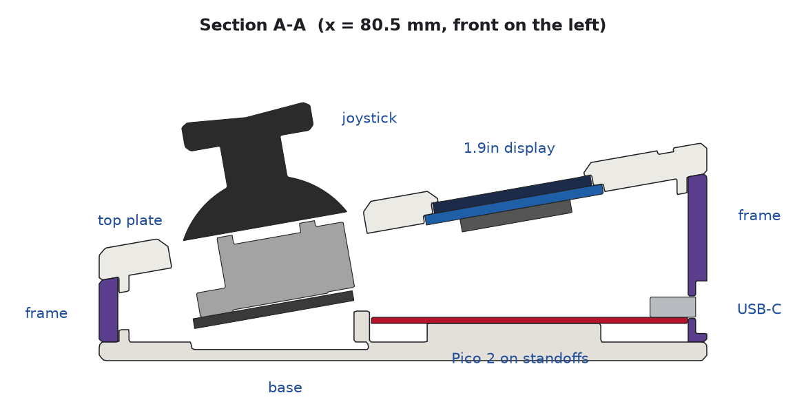
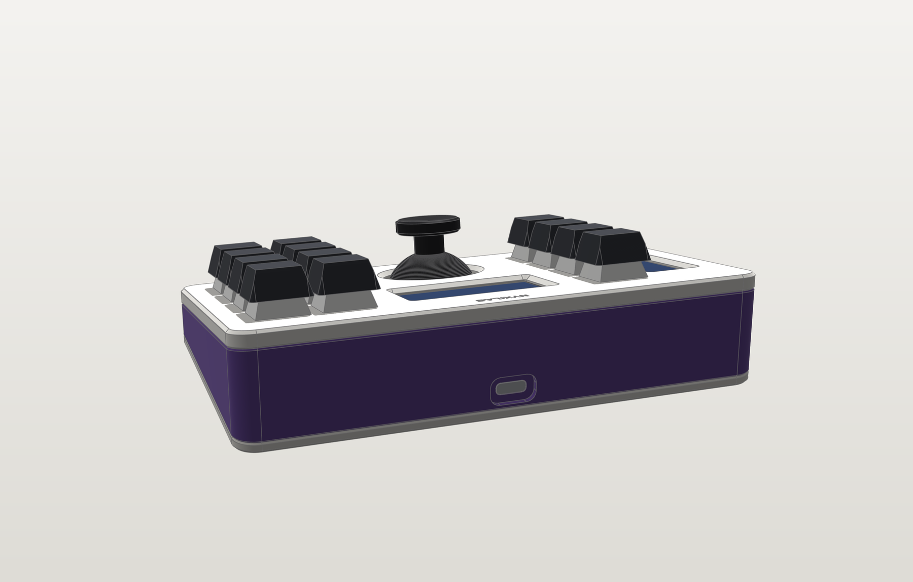
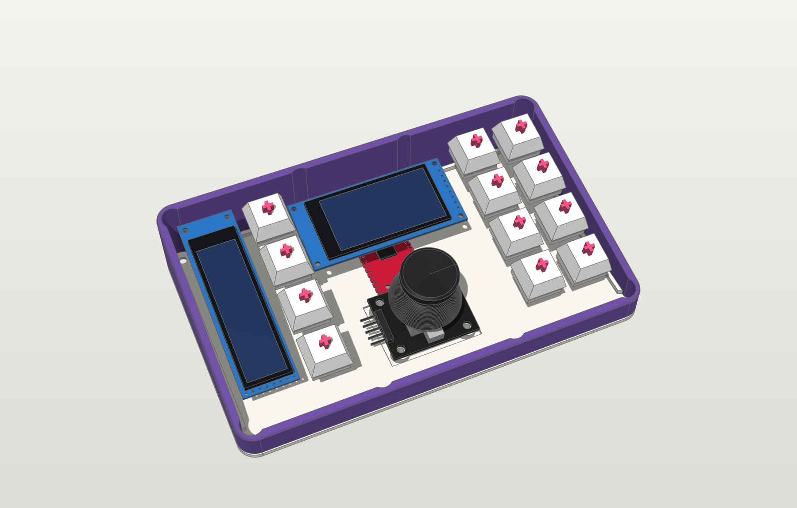
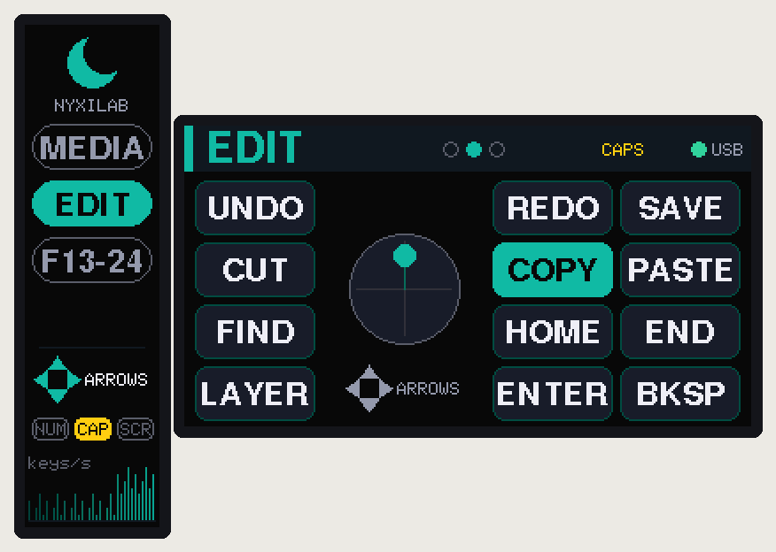
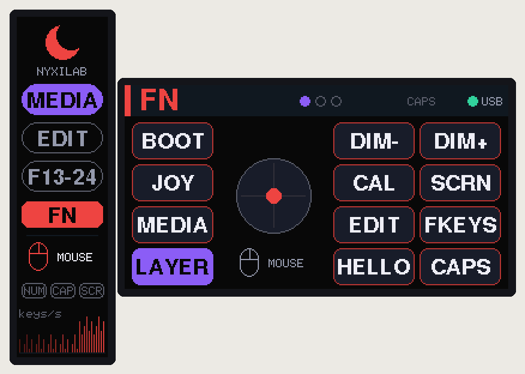
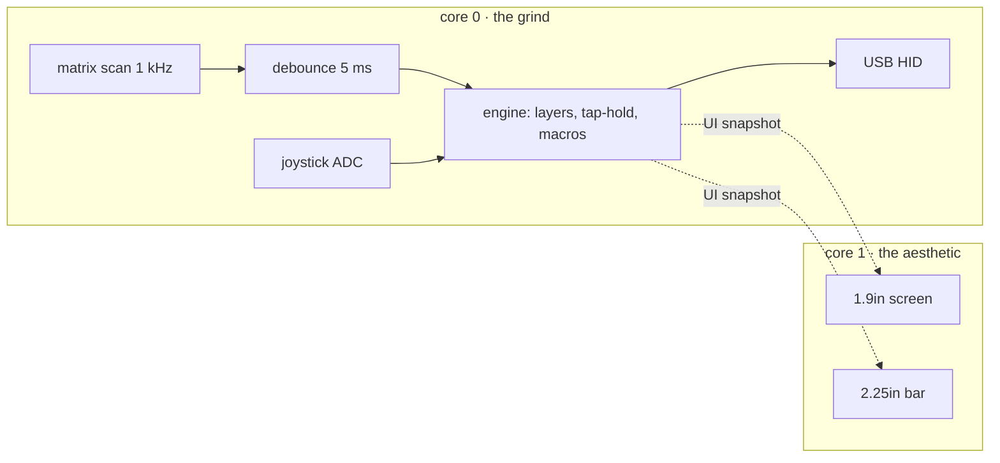

<div align="center">

# 🌙 nyxilab macropad

**12 keys. 2 screens. 1 thumbstick. 0 glue.**
<br>it's giving main character desk energy 💅


</div>

## tl;dr 🫠

a hand-wired, 3D-printed macropad built around a **Raspberry Pi Pico 2**, with two color
displays and an analog thumbstick. this monorepo has literally everything: the parametric
case, print-ready files, blueprints, wiring diagrams and the firmware. clone it, print it,
solder it, flex it. no custom PCB, no extra USB socket, no cap.

## the specs (no cap) 📋

| | |
|---|---|
| ⌨️ **inputs** | 12 × MX switches (hand-wired matrix + diodes) and a KY-023 thumbstick that clicks |
| 📺 **screens** | 1.9" 170×320 ST7789 IPS (main character) + 2.25" 76×284 ST7789P3 bar (the sidekick) |
| 🧠 **brain** | Pico 2 (RP2350) USB-C clone, or the OG Pico (RP2040) if that's what you've got |
| 📐 **case** | 3-layer wedge: top plate, contrasting centre frame, base · 10° tilt · 159 × 98 mm · 18 → 35 mm tall |
| 🔩 **held together by** | 8 × M3×8 countersunk screws into heat-set inserts. zero glue, fully serviceable |
| ⚡ **firmware** | USB keyboard + media + mouse, layers, tap-hold, macros, joystick as mouse / scroll / arrows |

## the lore 📜

every design decision had a reason, bestie. here's the tea:

- **three layers, two colors.** top plate + base in color A, the frame in color B, so you get
  that stripe all the way around. the screws pull the base and plate together *through* the frame,
  so the color seams close tight. no gaps, no drama.
- **all 8 screws are the same length.** the screw posts hang off the top plate, so the wedge
  doesn't make you buy three screw sizes. we love a consistent queen.
- **the Pico clone has no holes at the USB end** (rude). so the back wall thins down to 1.2 mm
  around the USB-C socket and holds it in place. any cable plugs in all the way. understood the assignment.
- **the joystick dome swings wider than you'd think** when you tilt it. posts hanging from the top
  plate would've been in the way, so the stick stands on tilted posts that grow out of the base.
- **the bar display only has holes at one end.** a tiny printed clamp (`bar_spine`) holds the
  other end. no glue, no hot-glue era.

<div align="center">

<br><sub>cross-section through the stick, the main screen, the Pico and the USB-C port. every mm accounted for 🧮</sub>
</div>

## glamour shots 📸

| exploded (it's a whole stack) | the back (USB-C, centered, obviously) |
|---|---|
|  |  |
| **what's inside** | **the underside of the plate** |
|  |  |

wanna spin it around yourself? open **[`docs/viewer.html`](docs/viewer.html)** in a browser:
orbit, explode the layers, slice it with a live section plane, toggle parts. it's lowkey addictive.

## the screens are eating fr 📺

these are rendered by the **actual firmware code** running on your PC (`make ui-sim`), not a mockup. real ones know.

| MEDIA layer | EDIT layer, caps lock on | FN held |
|---|---|---|
|  |  |  |

the 1.9" screen mirrors the physical key layout and lights up what you press. the bar shows your
layers, the joystick mode, NUM/CAPS/SCROLL straight from your computer, and a keys-per-second graph
so you can watch yourself go feral.

## what's in the box 📦

```
cad/                 parametric case model (build123d, Python)
  macropad_cad/      params -> layout -> parts, fit checks, exports, renders, drawings
  exports/
    stl/, 3mf/       print-ready parts, already oriented on the bed  (+ fit-tests/)
    step/            editable solids + full-color assembly
    freecad/         native FreeCAD document (parts + reference components)
    gltf/            web / AR viewing
    drawings/        blueprints (A3 PDF/SVG) + a 1:1 paper template
firmware/            PlatformIO project (Arduino-Pico core + TinyUSB + Adafruit GFX)
  src/core/          pure logic: keymap, engine (layers/tap-hold/macros), joystick, debounce
  src/hw/, src/ui/   matrix, USB HID, settings, the two displays
  test/              host unit tests (pio test -e native)
  tools/ui_sim/      renders the real firmware UI to PNG on your PC
  dist/              prebuilt UF2 files, just drag and drop
docs/                design notes, printing, assembly, wiring, images, 3D viewer
```

## speedrun any% 🏃‍♀️

1. **print the fit tests first** (`cad/exports/3mf/fit-tests/`, ~1 h total). they check the switch
   cut-out, both display pockets, the USB-C port and the joystick posts against *your* parts.
   something off? measure it, tweak `cad/macropad_cad/params.py`, run `make cad`. easy.
2. **print the case**: `top_plate` (color A, top face down), `frame` (color B), `base` (color A)
   and the tiny `bar_spine`. settings in [docs/printing.md](docs/printing.md).
3. **wire it and put it together**: [docs/wiring.md](docs/wiring.md) + [docs/assembly.md](docs/assembly.md).
4. **flash it**: hold BOOTSEL while plugging in the Pico, drop
   `firmware/dist/nyxilab-macropad-pico2.uf2` onto the `RP2350` drive (or `make flash`).
   after that, `make flash` reboots it for you, no button needed. W.

> [!WARNING]
> **red flags 🚩 read before printing.** a few dimensions came from photos, not datasheets:
> how far the Pico's USB-C sticks out past the board, the bar display's glass and hole positions,
> and the joystick's hole spacing. they're tagged `MEASURE` in `params.py`. grab your calipers,
> or at least print the fit tests. skipping this is a skill issue.

> [!TIP]
> image upside down on a screen? pointer going the wrong way? that's one setting each in
> `firmware/include/config.h` (`*_ROTATION`, `JOY_INVERT_X/Y`). the
> [firmware README](firmware/README.md) has the full list.

## build from source (for the terminally online) 🛠️

```bash
make setup      # Python venv for the CAD (build123d, manifold3d, ...) + PlatformIO
make cad        # fit checks, exports, renders, blueprints (~40 s)
make firmware   # Pico 2 build, UF2 copied to firmware/dist/
make test       # firmware logic unit tests on your PC
make ui-sim     # render the display UI to docs/images/ui/
make viewer     # rebuild docs/viewer.html from the latest model
```

the FreeCAD file rebuilds when `freecadcmd` is on your PATH (or set
`FREECAD_CMD=/path/to/freecadcmd`). everything else only needs Python and PlatformIO.



## receipts 🧾

we don't just vibe, we verify:

- **128 collision checks** on every build: each printed part against each component (plus room for
  solder joints and wiring) and against the joystick's full 25° swing. **0 clashes.**
- **printability check** in print orientation: no supports needed, only a few short bridges (the longest is a 10.5 mm foot recess).
- **19 firmware unit tests** (debounce, layers, tap-hold, macros, joystick math), all green ✅
- firmware builds for **both** Pico 2 and OG Pico with **zero warnings** under `-Wall -Wextra`.

## faq 💬

**does it need supports?** nah. every part prints flat as exported.

**glue?** zero. it's screws all the way down, so you can open it up and fix your wiring later.

**can I use the OG Pico (RP2040)?** yes bestie, `make firmware-pico` and flash `nyxilab-macropad-pico.uf2`. same footprint, same case.

**what do the keys do?** four layers out of the box: MEDIA, EDIT, F13–F24 and a hold-for-FN layer.
tap the front-left key for the next layer, hold it for FN. remap everything in `firmware/src/core/keymap.cpp`.

**macOS?** the shortcuts use Ctrl. swap `MOD_LCTRL` for `MOD_LGUI` in the keymap and you're golden.

## docs (the boring-but-important era) 📚

- **[docs/viewer.html](docs/viewer.html)**: interactive 3D model. orbit, explode, section, toggle parts
- [design notes](docs/design.md): layout, the 3-layer stack, how each part is held, what the checks verify
- [printing](docs/printing.md): orientation, settings, colors, the dimensions to verify first
- [assembly](docs/assembly.md): bill of materials + step-by-step build
- [wiring](docs/wiring.md): Pico pin map, matrix, displays, joystick
- [firmware](firmware/README.md): keymap, layers, joystick modes, display settings, serial console
- [CAD](cad/README.md): changing parameters and regenerating the files

<div align="center">
<br>
made with 💜, calipers, and way too many clearance checks
<br>
<sub>touch grass after soldering. you earned it 🌱</sub>
</div>
