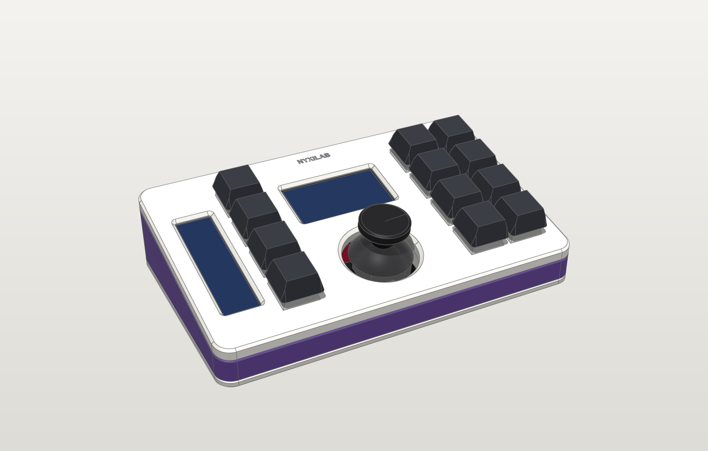
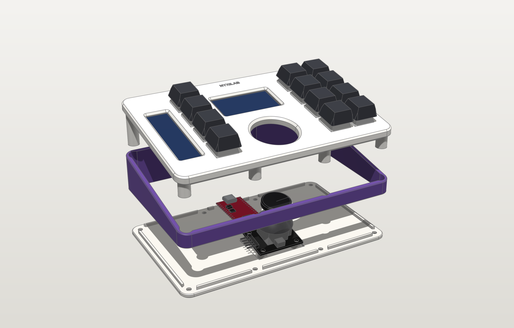

# Nyxilab Macropad

A hand-wired, 3D-printed macropad with two colour displays and an analog thumbstick,
built around a Raspberry Pi Pico 2 (RP2350). This monorepo holds the parametric case
design, print-ready files, blueprints, wiring diagrams and the PlatformIO firmware.



| | |
|---|---|
| **Inputs** | 12 × MX switches (hand-wired matrix with diodes), KY-023 thumbstick with click |
| **Displays** | 1.9" 170×320 ST7789 IPS (main), 2.25" 76×284 ST7789P3 bar (status) |
| **Controller** | Pico 2 (RP2350) USB-C clone, or the original Pico (RP2040) |
| **Case** | 3-layer wedge: top plate, contrasting centre frame, base. 10° tilt, 159 × 98 mm, 18 → 35 mm tall |
| **Fastening** | 8 × M3×8 countersunk screws from below into heat-set inserts, no glue needed |
| **Firmware** | Composite USB HID (keyboard, media, mouse), layers, tap-hold, macros, joystick mouse/scroll/arrows |

## Repository layout

```
cad/                 parametric case model (build123d, Python)
  macropad_cad/      params -> layout -> parts, fit checks, exports, renders, drawings
  exports/
    stl/, 3mf/       print-ready parts, already oriented on the bed  (+ fit-tests/)
    step/            editable solids + full-colour assembly
    freecad/         native FreeCAD document (parts + reference components)
    gltf/            web/AR viewing
    drawings/        blueprints (A3 PDF/SVG) and a 1:1 paper template
firmware/            PlatformIO project (Arduino-Pico core + TinyUSB + Adafruit GFX)
  src/core/          pure logic: keymap, engine (layers/tap-hold/macros), joystick, debounce
  src/hw/, src/ui/   matrix, USB HID, settings, the two displays
  test/              host unit tests (pio test -e native)
  tools/ui_sim/      renders the real firmware UI to PNG on your PC
  dist/              prebuilt UF2 files
docs/                design notes, printing, assembly, wiring, images
```

## Quick start

1. **Print the fit tests** in `cad/exports/3mf/fit-tests/` (≈1 h) and check them against
   your parts: switch cut-out, both display pockets, USB-C port, joystick posts.
   If anything is off, measure and adjust `cad/macropad_cad/params.py`, then `make cad`.
2. **Print the case**: `top_plate` (colour A, top face down), `frame` (colour B),
   `base` (colour A) and the small `bar_spine`. Settings in [docs/printing.md](docs/printing.md).
3. **Wire and assemble**: [docs/wiring.md](docs/wiring.md) and [docs/assembly.md](docs/assembly.md).
4. **Flash**: hold BOOTSEL while plugging in the Pico, drop
   `firmware/dist/nyxilab-macropad-pico2.uf2` onto the `RP2350` drive
   (or `make flash`). Later updates need no button: `make flash` reboots it for you.



## Build everything from source

```bash
make setup      # Python venv for the CAD (build123d, manifold3d, ...) + PlatformIO
make cad        # fit checks, exports, renders, blueprints (~40 s)
make firmware   # Pico 2 build, UF2 copied to firmware/dist/
make test       # firmware logic unit tests on the PC
make ui-sim     # render the display UI to docs/images/ui/
make viewer     # rebuild docs/viewer.html from the latest GLB
```

The FreeCAD document is regenerated when `freecadcmd` is on your PATH (or set
`FREECAD_CMD=/path/to/freecadcmd`); everything else only needs Python and PlatformIO.

## Documentation

- **[docs/viewer.html](docs/viewer.html)** – interactive 3D model (open in a browser): orbit, explode the layers,
  cut a live section plane, toggle parts
- [Design notes](docs/design.md) – layout, the 3-layer stack, how each part is held, what the fit checks verify
- [Printing](docs/printing.md) – orientation, settings, colours, dimensions to verify first
- [Assembly](docs/assembly.md) – bill of materials and step-by-step build
- [Wiring](docs/wiring.md) – Pico pin map, matrix, displays, joystick
- [Firmware](firmware/README.md) – keymap, layers, joystick modes, display settings, serial console
- [CAD](cad/README.md) – changing parameters and regenerating the files
