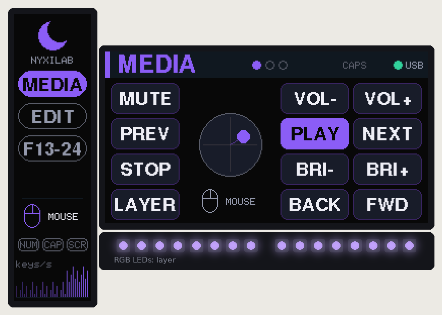
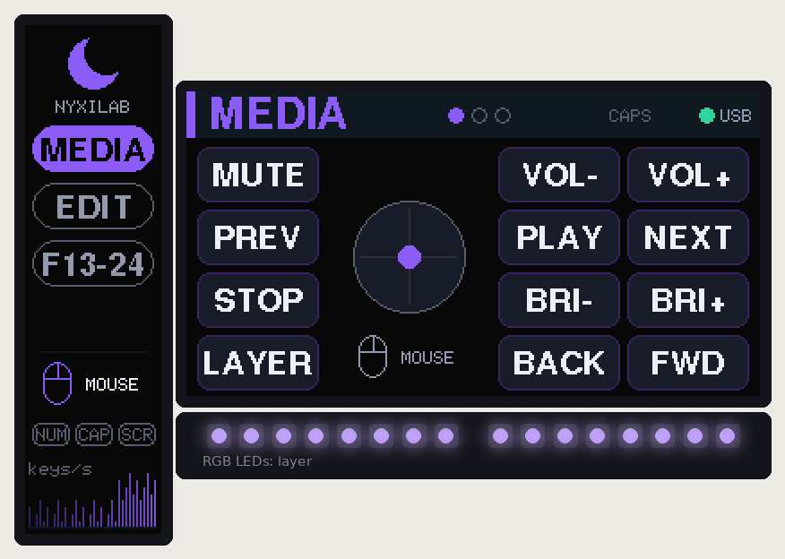

# Firmware

The firmware of both editions is one code base: four PlatformIO libraries here in
`lib/`, and one small project per edition that adds its centre control and keymap
([`joystick/firmware`](../../joystick/firmware), [`rotary/firmware`](../../rotary/firmware)).
It runs on the Raspberry Pi Pico 2 (RP2350) and the Pico (RP2040), on the
[Arduino-Pico](https://github.com/earlephilhower/arduino-pico) core with Adafruit
TinyUSB (composite HID), Adafruit GFX / ST7789 and Adafruit NeoPixel.

| Joystick edition | Rotary edition |
|---|---|
|  |  |

<sub>Rendered by `tools/ui_sim` from the real firmware code, with the 16 LEDs as the firmware
would light them.</sub>

## Build & flash

| Project | Environment | Board | UF2 |
|---|---|---|---|
| `joystick/firmware` | `pico2` (default) / `pico` | Pico 2 / Pico | `joystick/firmware/dist/nyxilab-macropad-joystick-pico2.uf2` (`-pico.uf2`) |
| `rotary/firmware` | `pico2` (default) / `pico` | Pico 2 / Pico | `rotary/firmware/dist/nyxilab-macropad-rotary-pico2.uf2` (`-pico.uf2`) |

```bash
cd joystick/firmware        # or rotary/firmware
pio run                     # Pico 2
pio run -e pico             # original Pico
pio run -t upload           # flash over USB (reboots the pad into the bootloader itself)
pio device monitor          # serial console, 115200
pio test -e native          # this edition's unit tests on the PC
```

From the repo root: `make firmware` (both editions, Pico 2), `make firmware-all` (all
four UF2 files), `make test` (all unit tests), `make ui-sim` (render the UI).

First flash, or if the firmware is broken: hold **BOOTSEL** while plugging the Pico
in and copy the UF2 for your board and edition to the `RP2350` (or `RPI-RP2`) drive.
Once the case is closed you do not need BOOTSEL any more:
- `pio run -t upload` resets the pad into the bootloader over USB,
- or hold the **back-left + front-right** keys while plugging in,
- or press **FN + BOOT** (hold the front-left key, press the back-left key).

## Features

- 4×3 hand-wired matrix, COL2ROW, 1 kHz scan, 5 ms per-key debounce
- Composite USB HID: 6-key keyboard + consumer (media) + mouse with wheel and pan
- Layers with momentary / toggle / to / next, tap-hold keys (hold-on-other-key), text macros
- **Joystick edition**: mouse, scroll or arrow keys, chosen per layer and cycled with
  FN + JOY; stick click = left click / middle click / Enter; radial dead zone, response
  curve, auto-learned travel
- **Rotary edition**: every layer says what the knob does (turn clockwise, turn
  counter-clockwise, press). FN + KNOB switches the current layer to a preset (volume,
  scroll, zoom, arrows) and back. The knob is read by pin-change interrupts with a
  detent-synchronised decoder, so bounce never adds steps; key taps from fast turns are
  queued, so none are lost.
- **RGB LED sticks** (2 × 8 WS2812B, both editions): layer colour with a flash on every key
  press or knob click, breathing, or a rainbow running around the case; FN + LED cycles
  the modes. They follow the display brightness and idle dimming and go dark while the host
  sleeps; a 250 mA current budget keeps the pad inside a USB 2.0 port's limit.
- Main display (1.9"): layer name, the 12 key labels in their physical layout with live
  press highlight, the joystick position and mode or a knob dial with its current
  function, CAPS and USB state
- Bar display (2.25"): layer list, joystick mode or knob function, NUM/CAPS/SCROLL LEDs
  from the host, key-press activity graph
- Backlight PWM with FN + DIM±, dims after 1 min idle, off after 10 min or when the host sleeps
- Settings (brightness, per-layer stick mode or knob preset, knob direction, LED mode,
  last layer, joystick calibration) stored in flash
- Dual core: input + USB on core 0; the displays and the LEDs on core 1 (off-screen
  canvases, no flicker)

## Default keymap

Rows are listed back (row 0) to front (row 3); column 0 is the single column next to the bar display.

| Layer | Col 0 | Col 1 | Col 2 | Joystick | Knob: turn right / left / press |
|---|---|---|---|---|---|
| **MEDIA** | MUTE / PREV / STOP / LAYER | VOL− / PLAY / BRI− / BACK | VOL+ / NEXT / BRI+ / FWD | mouse | volume up / down / mute |
| **EDIT** | UNDO / CUT / FIND / LAYER | REDO / COPY / HOME / ENTER | SAVE / PASTE / END / BKSP | arrows | redo / undo / save |
| **F13-24** | F13 / F16 / F19 / LAYER | F14 / F17 / F20 / F22 | F15 / F18 / F21 / F23 | scroll | scroll down / up / middle click |
| **FN** (hold LAYER) | BOOT / JOY or KNOB / MEDIA / (held) | DIM− / CAL or REV / EDIT / HELLO | DIM+ / SCRN / FKEYS / LED | – | screen brightness + / − / screens on-off |

LAYER (front-left key): **tap** = next layer, **hold** = FN. Holding LAYER and turning the
knob uses the FN binding straight away. F13–F24 are handy for binding actions in OBS,
IDEs and window managers without clashing with real shortcuts.

The two centre-control keys on the FN layer differ per edition: **JOY** (cycle the
stick mode) and **CAL** (re-centre) in the joystick keymap, **KNOB** (cycle the knob
preset for this layer) and **REV** (flip the turning direction) in the rotary keymap.

## Customising

| What | Where |
|---|---|
| Keys, labels, layers, colours, tap-hold, macros, stick modes or knob bindings and presets | `<edition>/firmware/src/keymap.cpp` |
| Pins, display rotation / inversion / BGR, stick or knob direction, LED count and brightness, SPI speed, idle times | `<edition>/firmware/include/config.h` |
| Joystick feel (dead zone, curve, speeds, arrow thresholds) | `JoyConfig` in `joystick/firmware/src/joystick.h` |
| LED effects (flash length, breathing and rainbow speed) | `lib/nyx_core/src/core/led_fx.h` |
| Boot-to-bootloader key combo | `BOOT_COMBO` in `lib/nyx_core/src/core/keymap.h` |

Action helpers for the keymap (`lib/nyx_core/src/core/keycodes.h`):
`K(hid::A)`, `KC(MOD_LCTRL, hid::C)`, `CC(cc::VOL_UP)`, `MB(MB_LEFT)`, `WHEEL(-1)`,
`MO(n)`, `TG(n)`, `TO(n)`, `LNEXT`, `TH(i)`, `MACRO(i)`, `SYS(SYS_BOOTLOADER)`,
`JOY(JoyMode::Scroll)`, `KNOB_PRESET(i)`, `KNOB_CYCLE`, `___` (transparent), `XX`
(nothing). Shortcuts use Ctrl – on macOS use `MOD_LGUI`.

A layer is `{"NAME", colour, centre, {keys}}`. `centre` is `STICK(JoyMode::Mouse)` in
the joystick keymap, `KNOB(clockwise, counter-clockwise, press, "LABEL")` in the rotary
keymap, or `CENTRE_INHERIT` to fall through to the layer below. Each knob detent taps a
key, consumer or mouse-button action once, and runs a wheel step or system command
immediately.

**Display orientation**: if an image is upside down, change `MAIN_ROTATION` (1 ↔ 3) or
`BAR_ROTATION` (2 ↔ 0). Wrong colours: toggle `*_INVERT`; red/blue swapped: set `*_BGR`.

## Serial console

`pio device monitor` (115200): `help`, `info` (layers, USB, lock LEDs, brightness, LED
mode, plus the stick calibration or the knob binding), `layer <n>`, `boot`, and the
edition's own commands: `joy` (raw stick values for 5 s) and `cal` (re-centre), or
`enc` (knob pins and position for 5 s).

## Code layout

```
common/firmware/lib/
  nyx_core/src/core/    pure C++ (no Arduino), unit-tested here (pio test -e native, 23 tests)
    keycodes.h          action encoding (32-bit: type | argument) + HID usages
    keymap.h            layer / key / centre-control types; the layers live in the editions
    debounce.h          per-key deferred debounce
    engine.h/.cpp       layers, tap-hold, macros, knob bindings and queued taps -> HID report state
    led_fx.h/.cpp       LED effects and the current budget
  nyx_hw/src/hw/        matrix scan, USB HID report scheduler, settings in flash
  nyx_ui/src/ui/        UI state hand-over between the cores, rendering, ST7789 panels, WS2812 sticks
  nyx_app/src/app/      the application: core 0 loop, console, UI feed; core 1 displays + LEDs
                        app::Centre is the interface an edition's centre control implements
joystick/firmware/      config.h, keymap.cpp, stick.cpp (JoystickCentre), joystick.cpp, main.cpp, 6 tests
rotary/firmware/        config.h, keymap.cpp, knob.cpp (KnobCentre), quad_decoder.h, main.cpp, 4 tests
tools/ui_sim/           builds render.cpp + led_fx.cpp + the edition's keymap natively and writes PNGs
```

An edition's `main.cpp` is four lines: it hands its `Centre` (the stick or the knob)
to `app::begin()`. The `Centre` reads its hardware, tells the engine what to do, fills
its part of the UI snapshot, answers its FN-layer commands (JOY/CAL or KNOB/REV) and
its console commands, and keeps 16 bytes in the flash settings.
