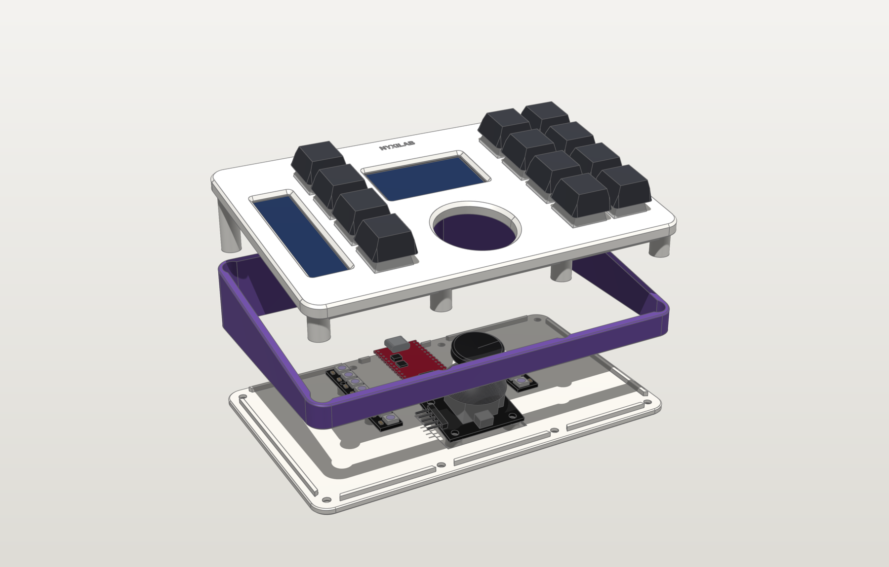
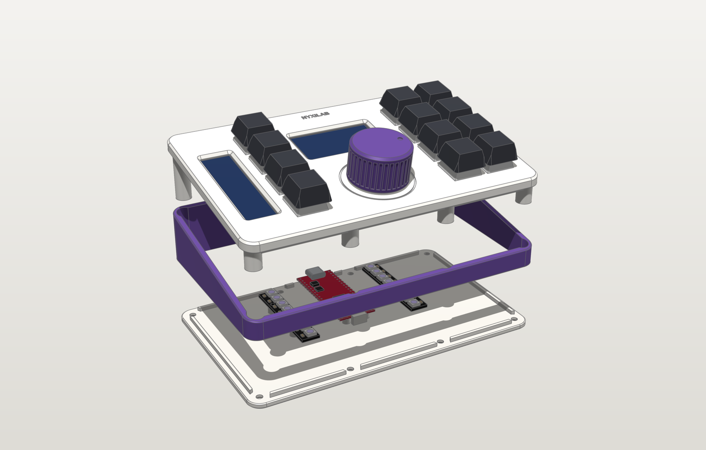

# Assembly

| Joystick edition | Rotary edition |
|---|---|
|  |  |

Both editions share the frame, the bar-display spine, the displays, the keys, the Pico
and the two RGB LED sticks. They differ in the centre control, the top plate and the
base (the joystick stands on posts in the base; the encoder hangs from the plate).

## Bill of materials

| Qty | Part | Notes |
|---|---|---|
| 1 | Raspberry Pi Pico 2 (RP2350), USB-C version | the original Pico (RP2040) also works |
| 12 | MX-style switches | plate-mount (3-pin) or PCB-mount (5-pin, clip the two plastic legs or leave them) |
| 12 | 1u MX keycaps | any profile |
| 12 | 1N4148 diodes | through-hole |
| 1 | 1.9" 170×320 ST7789 IPS module, 8-pin (GND VCC SCL SDA RES DC CS BLK) | |
| 1 | 2.25" 76×284 ST7789P3 module, 8-pin (GND VCC SCL SDA RST DC CS BL) | |
| 2 | WS2812B LED stick, 8 × 5050 on a 53 × 10 mm PCB (CJMCU-2812-8 style) | chained, on the base |
| 1 | 1N4001 (any 1N400x) diode | LED 5 V feed, see [wiring](wiring.md#rgb-led-sticks-both-editions) |
| 1 | 330 Ω resistor | LED data line |
| 8 | M3 heat-set inserts, 5.7 × 4.6 mm | |
| 8 | M3 × 8 countersunk screws (ISO 10642 / DIN 7991) | case |
| 4 | M2 × 4 pan-head self-tapping screws | 1.9" display |
| 2 | M2 × 8 pan-head self-tapping screws | bar display + spine |
| 6 | M2 × 5 pan-head self-tapping screws | Pico (2), LED sticks (4) |
| 4 | Rubber feet Ø10 × 3 mm (3M Bumpon or similar) | |
| – | 26–28 AWG silicone wire (or 30 AWG wire-wrap), ~2.5 m in several colours | |
| – | Kapton tape, heat-shrink tubing, small cable ties | wire dressing |

**Joystick edition** adds:

| Qty | Part | Notes |
|---|---|---|
| 1 | KY-023 / HW-504 thumb joystick module | |
| 4 | M3 × 6 pan-head self-tapping screws | joystick posts |

**Rotary edition** adds:

| Qty | Part | Notes |
|---|---|---|
| 1 | KY-040 rotary encoder module (EC11, 20 detents, M7 bushing, 6 mm D-shaft) | its washer and M7 nut hold it in the plate |
| 1 | printed knob | `rotary/cad/exports/3mf/knob.3mf` |

Tools: soldering iron (with a heat-set insert tip if you have one), flush cutters,
2.5 mm hex / Phillips #0 and #1 drivers, a small wrench or pliers for the encoder nut,
multimeter.

## 1 · Prepare the printed parts

1. Remove any stringing from the switch cut-outs and display windows.
2. Press the **8 heat-set inserts** into the boss ends of the top plate
   (see [printing.md](printing.md#heat-set-inserts)).
3. Stick the **rubber feet** into the four recesses under the base.
4. Rotary edition: try the **knob** on the encoder shaft now. It should need a firm push
   and not wobble; see [printing.md](printing.md#the-knob-rotary-edition) if it does not.

## 2 · Build the top plate

1. **Switches**: push all 12 switches into the plate from the top until both clips snap.
   Orient them the same way (e.g. the two metal pins towards the back).
2. **1.9" display**: lay the plate top-down, drop the module glass-first into its
   pocket (header towards the right-hand key block), and fix it with **4 × M2×4**.
   Snug, not tight – the screws cut their own thread.
3. **2.25" bar display**: drop it into the long pocket, header towards the *front*.
   Put the **spine** over its back (crossbar at the hole end, pad at the header end)
   and drive **2 × M2×8** through the spine and the module's two holes.
4. **Rotary edition – encoder**: take the nut and washer off the KY-040, push its bushing
   up through the round hole from below, header pointing left (towards the left key
   column; that is the orientation the fit checks cover). The square encoder body drops
   into the square pocket, which stops it from turning. From the top, fit the washer
   and the nut and tighten gently: the nut clamps a 2 mm section of the plate. Don't fit
   the knob yet.
5. Peel the protective films off the display glass (from the top) now or at the very end.

## 3 · Hand-wire the matrix

Follow the [soldering guide](soldering.md) (it has step-by-step pictures) and the
[matrix diagram](wiring.md#key-matrix). In short:

1. Solder a **1N4148** to one pin of every switch, cathode band pointing away from the
   switch, towards where the row wire will run.
2. **Rows** (4 wires): join the diode cathodes of each physical row – left key, then
   across under the display / centre-control area to the two right keys. Row 0 is the
   back row.
3. **Columns** (3 wires): join the other switch pin of every key in a column, front to back.
4. Check with a multimeter (diode mode): column → row conducts through a pressed key only.

Keep wires flat against the plate underside and away from the joystick opening (or the
encoder); a few bits of Kapton tape help.

## 4 · Wire the modules, the LEDs and the Pico

Use the [wiring diagram](wiring.md) and the [wiring map](soldering.md#the-wiring-map).
Cut every wire from the top plate to reach the Pico's position at the back centre
**plus ~8 cm of slack**, so the top plate can be opened like a book later.

- **Displays**: 8 wires each, soldered from the back of the module (the relief grooves in
  the plate clear the solder on the glass side).
- **Joystick** (5 wires) or **encoder** (5 wires): **power it from 3V3, not 5 V.**
  Remove the right-angle header or solder to it; there is room for either.
- **LED sticks** (these stay in the base, so their wires only need to reach the Pico):
  1. Right stick, DIN end: three wires to the Pico: 5V → VBUS (pin 40) with the
     **1N4001** in line (band towards the stick), GND → pin 38, DIN → GP28 (pin 34) with
     the **330 Ω** in line close to the stick. Heat-shrink both.
  2. A three-wire jumper, about 70 mm, from the right stick's DOUT end (5V, GND, DOUT) to
     the left stick's DIN end (5V, GND, DIN). In the case the two sticks point in opposite
     directions, so this jumper runs across the front of the Pico.
  3. Solder to the pads on the back of the sticks and keep the joints flat. The posts
     leave 3 mm under the sticks for them.
- Solder all wires to the Pico from the top.

Flash the firmware now (drop the UF2 for your edition onto the `RP2350` drive while
holding BOOTSEL; see the [firmware README](../common/firmware/README.md)) and test every key,
both displays, the stick or the knob, and the LEDs before closing the case. The LEDs
should light in the layer colour and flash on every key press. The serial console
(`make monitor`) prints raw values with the command `joy` or `enc`.

## 5 · Mount the LED sticks, the joystick and the Pico in the base

1. **LED sticks**: LEDs up, one each side of the Pico's cradle, with the mounting holes
   over the posts (the holes are on the outer side of each stick). The **right** stick
   has its DIN end at the back, the **left** stick has its DIN end at the front. Fix each
   stick with **2 × M2×5**.
2. Place the **frame** on the **base** (the lip segments locate it).
3. Joystick edition: set the **joystick** on its four posts, header to the left,
   click-switch towards the front, and fix it with **4 × M3×6** from above.
4. Insert the **Pico**: tilt it, push the USB-C receptacle into the opening in the back
   wall, lower the far end onto the two standoffs and fix it with **2 × M2×5**.
   A cable must now plug in fully from outside.

## 6 · Close the case

1. Fold the wires into the case: keep them out of the joystick opening and away from the
   stick's mechanism, and don't cover the LEDs.
2. Lower the top plate onto the frame: the joystick knob passes through its opening (or
   the encoder module hangs into the space in front of the Pico), the lip drops inside
   the frame and the bosses slide into their saddles.
3. Turn the pad over and drive the **8 × M3×8 countersunk** screws. Tighten evenly in a
   cross pattern until the seams close – do not overtighten.
4. Fit the keycaps.
5. Rotary edition: turn the shaft so its flat points where you want the indicator dot to
   start, line up the flat in the knob's bore and **press the knob on until it stops** on
   the shaft tip. It then sits 1 mm above the plate, and pushing the knob presses the
   encoder's switch.

## Opening it again

Pull the knob off (rotary edition), remove the 8 bottom screws and lift the top plate; it
stays connected to the Pico by the wires. The Pico comes out with its two screws; tilt
it out of the port. The LED sticks and their wiring stay in the base.
