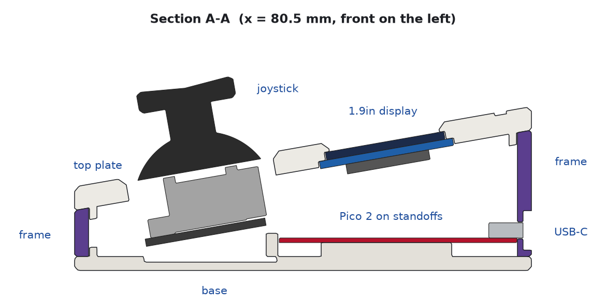
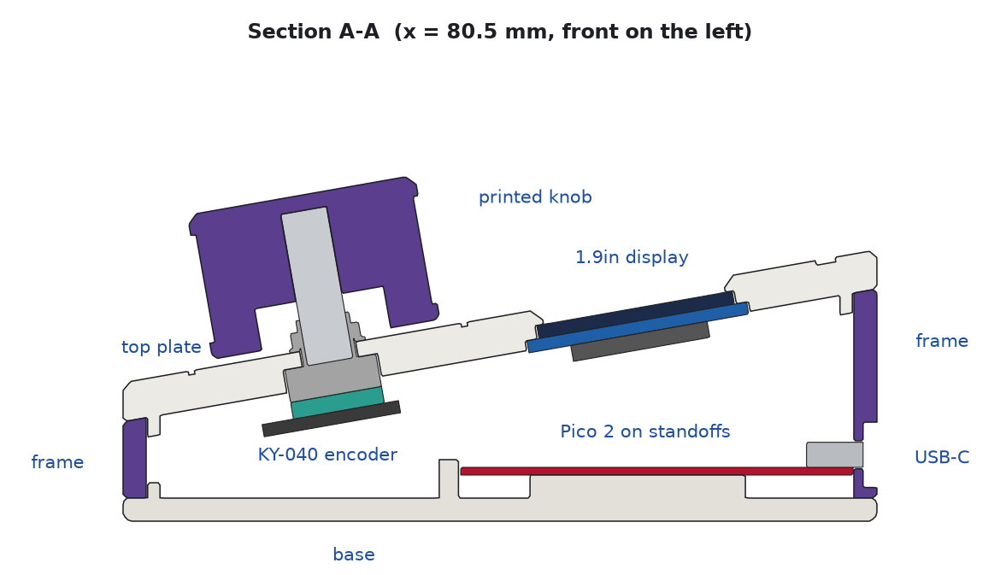

# Design notes

How the requirements turned into the case, why each part is held the way it is,
and what is verified automatically on every build.

There are two editions of the same case. They share the frame, the bar-display spine,
the layout, the electronics and the firmware, and differ only in the centre control:

- **joystick edition**: KY-023 thumbstick ([`joystick/`](../joystick), files in `joystick/cad/exports/`)
- **rotary edition**: KY-040 rotary encoder with a printed Ø30 knob ([`rotary/`](../rotary), files in `rotary/cad/exports/`)

The case model is one shared package (`common/cad/macropad_cad`); each edition adds its
centre control in its own `cad/edition.py`. Frame and bar spine come out identical.

Both have two RGB LED sticks on the base.

| Joystick edition | Rotary edition |
|---|---|
|  |  |

## Requirements (from the brief and sketches)

| Requirement | Where it is solved |
|---|---|
| Wedge case, USB-C at the back, low and centred | 10° slope, port 8.6 mm above the desk, centred on the back wall |
| Top plate / centre plate in another colour / bottom base | three separate prints; the centre frame is the colour band all around |
| 4 keys next to a 76×284 bar display, 8 keys on the right, 1.9" display above a joystick | top layout below, taken 1:1 from the sketch |
| Hand-wired switches and diodes, no custom PCB, no extra USB socket | plate-mount MX cut-outs, Pico 2's own USB-C used through the wall |
| 3D printable, easy to assemble, screws (glue optional) | every part prints without supports; 8 identical case screws; nothing needs glue |
| Joystick **or** rotary knob | two editions of one shared model, each with its own `edition.py`; the rotary edition reuses the frame and spine |
| LED sticks on the base, either side of the Pico | two 8 × WS2812B sticks on screw posts, LEDs up; the translucent-frame option makes the colour band glow |

## Top layout

All positions are on the tilted top surface (u → right, v → up the slope), in mm.

| Element | u | v |
|---|---|---|
| 2.25" bar display window centre | 17.04 | 46.60 |
| Key column C0 | 38.53 | rows 19.52 / 38.58 / 57.62 / 76.67 |
| 1.9" display window centre | 80.53 | 67.15 |
| Joystick axis / knob axis | 80.53 | 27.00 |
| Key columns C1 / C2 | 122.53 / 141.58 | same rows |

Key pitch is 19.05 mm (standard 1u). The centre gap between the key columns is set
by the 1.9" module (62 mm PCB), and the window is kept centred over the joystick (or
knob) even though the active area is off-centre on that PCB. Plate borders are ~8 mm left/right,
10.5 mm front, 13.8 mm back (the back border carries the engraved logo, set
`logo = ""` in `params.py` to remove it).

## The stack

```
top plate  5.0 mm, tilted 10 deg   colour A   switches, displays, 8 hanging screw bosses
frame      9.9 mm (front) - 27.2 mm (back) walls, 3.0 mm thick   colour B, USB-C port
base       3.0 mm   colour A       Pico cradle, LED-stick posts, joystick posts*, countersinks, feet
                                   (* joystick edition only)
```

* The screw bosses belong to the **top plate** and hang straight down (world-vertical)
  inside the frame's corners and edges. M3 heat-set inserts sit at their lower ends,
  0.3 mm above the base. Eight **M3×8 countersunk** screws go up through the base.
  All eight are the same length regardless of the wedge.
* Because the bosses stop 0.3 mm short of the base, the screws pull the base and the
  plate together **through the frame** – the frame is the compression member, so the
  two colour seams close tightly.
* The frame has vertical saddles that wrap the bosses (locating it in X/Y); the plate
  has a 1.6 × 2.5 mm lip that drops inside the frame; the base has lip segments. The
  three parts self-align when stacked. 0.5 mm chamfers at both seams form V-grooves
  that hide small print differences.

## How each component is held

### MX switches (12)
14.0 × 14.0 cut-outs in a 1.5 mm skin (MX spec), with a 15.0 × 15.6 mm relief pocket
below so the clips can spring out under a 5 mm-thick, stiff plate. Switches clip in
from the top; wiring hangs below. Front-row wiring clears the base by 6.5 mm.

### 1.9" display (MSP1901-compatible module, 62 × 29 mm PCB)
Stepped pocket from below: glass (+0.25 mm), then PCB (+0.25 mm), with a 2 mm skin
above the glass and a 1.4 mm × 45° bevelled window around the visible area. A relief
groove clears the header solder joints on the glass side. Four **M2×4** self-tapping
screws through the module's own corner holes into blind pilots (0.7 mm of skin left
above, so nothing shows on top).

### 2.25" bar display (73.15 × 21.08 mm PCB, holes only at one end)
Same pocket scheme. The module has mounting holes at one end only, so the printed
**spine** clamps it: its crossbar is screwed with **2 × M2×8** through the module's two
holes, it arches 3 mm over the FPC / ZIF / parts on the back, and a pad presses the
PCB near the header end (0.2 mm preload). The header points to the front of the case
so the window can stay centred between the two corner bosses.

### KY-023 joystick
The stock knob's dome (Ø26.8) is a sphere around the stick's pivot; at 25° tilt its
rim sweeps down to ~6 mm above the module PCB. Posts hanging from the top plate at the
module's corner holes would sit inside that sweep, so the module stands on **four posts
that grow out of the base**, tilted 10° so the stick is perpendicular to the plate,
with **M3×6** self-tapping screws from above. The plate opening is Ø32 with a
1.5 mm bevel; the knob sweep (+0.4 mm) clears it by 0.7 mm at the underside. A 1.2 mm
relief in the base clears the solder joints under the module. The steel frame of the
stick sits 1.5 mm below the plate surface; the knob stands ~18.6 mm above the plate.

### KY-040 rotary encoder and knob (rotary edition)
The encoder is **panel-mounted** like a potentiometer: its M7 bushing goes up through a
Ø7.4 hole, and the washer and nut on top clamp a 2.0 mm section of the plate. From
below, a 12.5 mm square pocket takes the encoder body, so the module cannot turn when
the knob is turned hard. It hangs from the plate on its own. The base has no posts in
this edition, and the solder joints clear the base by 6.5 mm. The case height and the
frame are unchanged, so both editions share the frame and the spine.

The printed **knob** (Ø30 × 19, 36 flutes, indicator dimple) is a press fit on the
6 mm D-shaft. Its bore is round below the flatted part of the shaft and D-shaped where
the flat is (9.5 mm of D engagement), and it ends exactly at the shaft tip. So the knob
presses on until it stops at 1 mm above the plate, and a push on the knob goes straight
into the encoder's switch (0.5 mm travel, still clear of the plate). A recess under the
knob covers the nut, the washer and the bushing thread. Around the knob, a 0.8 mm
engraved ring (Ø36) frames it. A sunken well would have printed as a 34 mm bridge on
the visible face; the ring prints as two tiny bridges instead.

### RGB LED sticks (both editions)
Two 53 × 10 mm sticks of eight WS2812B LEDs lie on the base floor, one each side of the
Pico, running front to back as in the sketch. Each stick sits on **two Ø5 posts** at its
own mounting holes and is held by **2 × M2×5**. The posts hold the PCB 3 mm above the
floor, which leaves room for the solder joints and wires on the back of the stick's end
pads. The LEDs face up into the case: in a translucent frame the whole middle stripe
lights up in the layer colour, and in the joystick edition light also comes out around
the stick. The sticks stay 1.5 mm or more from everything else (bosses, switch wiring,
the joystick header), and are checked like every other component. Electrically they are
chained on one GPIO; see [wiring.md](wiring.md#rgb-led-sticks-both-editions).

### Pico 2 USB-C clone
The clone has **no mounting holes at the USB end**. It sits on two Ø4.2 standoffs at
the debug-end holes (**M2×5** self-tapping), a centre rail and a forward stop. The USB
end is held by the port itself: the back wall is thinned to 1.2 mm around the
receptacle with a 9.34 × 3.66 mm opening (0.2 mm clearance), and the receptacle face
ends flush with that thin wall. A 14 × 8.5 mm recess outside takes the plug overmold,
so any USB-C cable seats fully. Plugging pushes against the standoffs and the stop;
unplugging pulls against the wall.

## Heights

The front height (18 mm) is set by the joystick: steel frame 1.5 mm below the plate,
12.2 mm mechanism, 1.6 mm PCB and 1.5 mm of solder joints must fit above the base at
the lowest (front) edge of the tilted module. With 10° tilt the back is 35.3 mm. The
rotary edition keeps the same heights (the encoder would fit a lower case) so that the
frame is shared; the knob top is 44.8 mm above the desk. Change
`tilt_deg` / `front_h` in `common/cad/macropad_cad/params.py`; the fit checks will tell
you if something no longer fits (8° gives ~18.3 → 32 mm).

## Automated verification (`make cad-check`)

Every build runs:

* **Interference pairs** with manifold3d: **169** for the joystick edition, **191** for the
  rotary edition, **0 clashes**. Each printed part is tested against each component
  keep-out (component + solder joints + hand-wiring room), against the joystick knob's
  full sweep (all directions to 25°, plus 1.5 mm press travel) or the spinning knob's
  envelope, printed parts against each other, and components against each other
  (the LED sticks included).
* **Clearance report**: joystick joints above the base (1.9 mm), knob sweep vs opening
  (0.72 mm); encoder joints above the base (6.5 mm), knob above the plate (1.0 mm, 0.5
  while pressed), D-flat engagement (9.5 mm); LED joints above the base (1.5 mm), LED
  sticks to their nearest neighbour (1.5 mm); front switch wiring above the base
  (6.5 mm), frame wall behind a boss (1.95 mm), insert engagement (4.7 mm). The numbers
  are saved to `<edition>/cad/exports/checks.json` on every build.
* **Printability report** in print orientation: flags any down-facing surface steeper than
  50° and lists bridges. Current result: only small bridges (logo letters, the USB
  openings ≤ 8 mm, the Ø10.5 feet recesses, the engraved ring's 0.8 mm groove) and a
  1 mm edge chamfer at 50°.

## Dimensions that came from photos (measure these)

The display drawings and the KY-023 measurements are from published data; these values
were estimated from your photos and should be checked with calipers (they are marked
`MEASURE` in `common/cad/macropad_cad/params.py`, or in the edition's `cad/edition.py` for the centre control):

| Parameter | Default | What to measure |
|---|---|---|
| `Pico2.usb_overhang` | 1.3 | how far the USB-C receptacle sticks out past the PCB edge |
| `Pico2.t` | 1.0 | PCB thickness of your clone |
| `DisplayBar.lcm_x0` | 8.2 | bar module: hole-end PCB edge to the start of the glass |
| `DisplayBar.hole_x`, `hole_y` | 2.5, 8.15 | bar module hole position from the end / centre line |
| `DisplayBar.pcb_t` | 1.2 | bar module PCB thickness |
| `Display19.hole_d` | 2.2 | 1.9" module hole diameter (M2 must pass) |
| `JoystickKY023.hole_dx`, `hole_dy` | 26.7, 20.3 | joystick hole spacing (sources say 26.5–26.7 × 19.0–20.3) |
| `EncoderKY040.shaft_len` | 20.0 | encoder body top face to the shaft tip (15 / 20 / 25 mm versions exist) |
| `EncoderKY040.body_h`, `bushing_h` | 6.5, 6.0 | PCB top to the body's top face; bushing height |
| `EncoderKY040.pcb_l`, `pcb_w`, `axis_dx`, `axis_dy` | 24, 18, 1.4, 1.15 | module PCB size and where the shaft sits on it |
| `LedStick.pcb_l`, `pcb_w` | 53.0, 10.0 | LED stick PCB size |
| `LedStick.hole_pitch`, `hole_y`, `hole_d` | 26.4, 2.9, 2.5 | LED stick mounting holes: spacing, offset from the centre line, diameter |

The fit-test coupons check exactly these.
