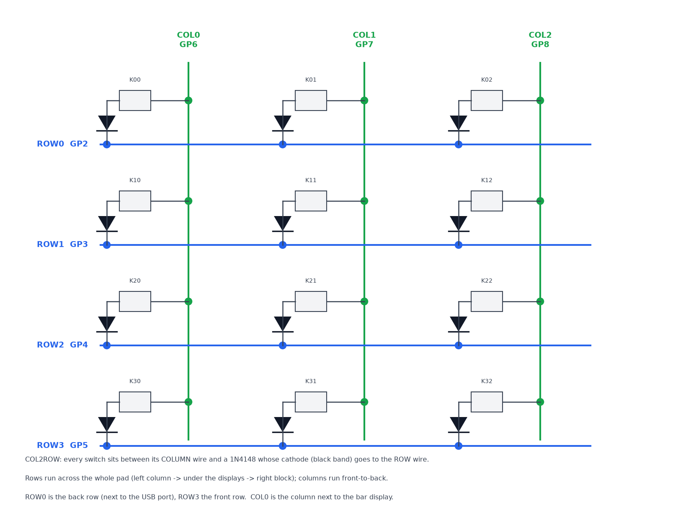
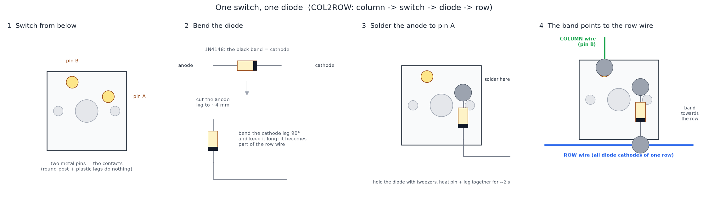
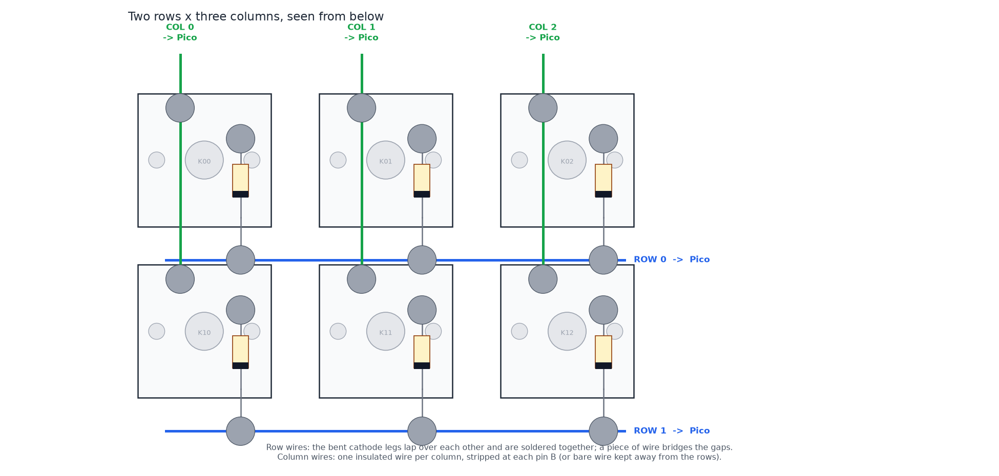
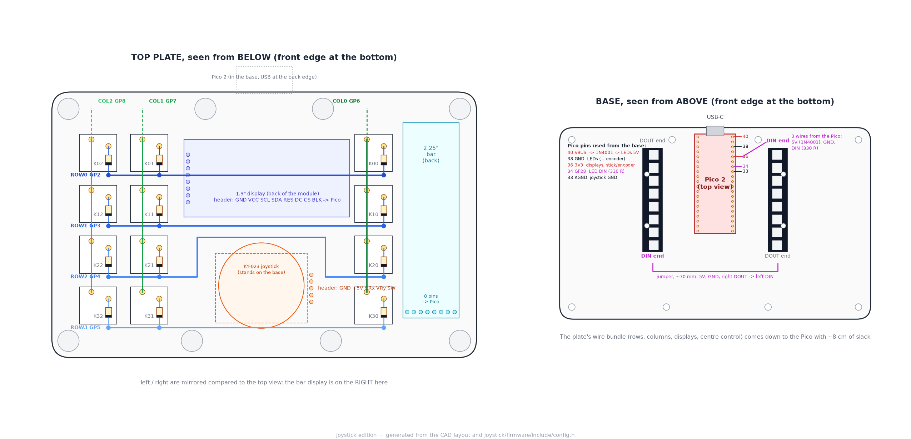
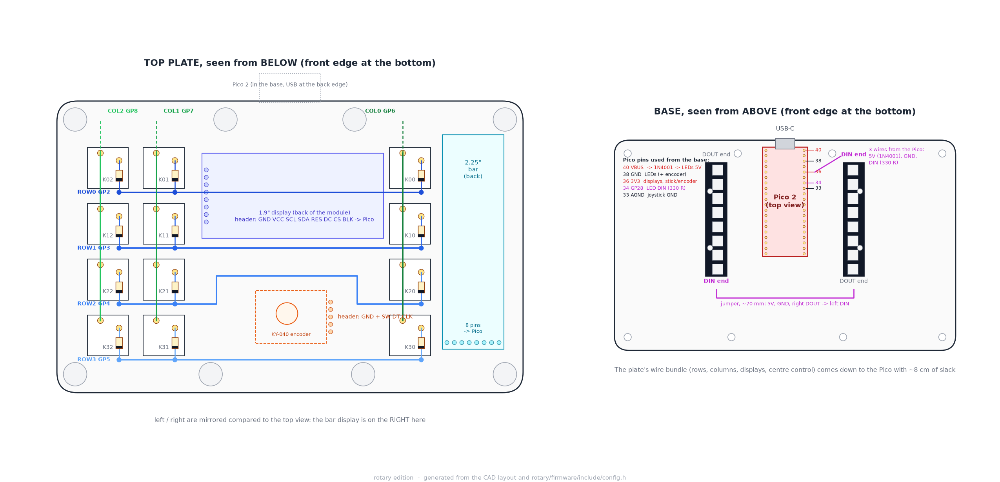

# Soldering guide

Everything in this pad is hand-wired: no PCB, just switches, diodes, wire and the
modules' own pin headers. This guide takes you from a bare top plate to a wired
pad, step by step. Read it once before you heat the iron, then keep the
[wiring map](#the-wiring-map) next to you.

What you will solder:

| Part | Joints | Wires to the Pico |
|---|---|---|
| 12 MX switches + 12 diodes | 12 diodes, 4 row buses, 3 column wires | 7 (4 rows, 3 columns) |
| 1.9" display | 8 pins | 8 |
| 2.25" bar display | 8 pins | 8 |
| KY-023 joystick **or** KY-040 encoder | 5 pins | 5 |
| 2 × WS2812B LED sticks | 6 pads + a 3-wire jumper | 3 (5V through a diode, GND, data through a resistor) |
| Pico 2 | 31 pins, soldered from the top | – |

About two evenings of work if it is your first hand-wired build.

## Tools and materials

- **Soldering iron** with a fine chisel or conical tip, temperature controlled.
  320–350 °C for leaded solder (63/37 or 60/40 flows best), 350–380 °C for
  lead-free. A cheap pen iron works; a T12 / Pinecil-class iron makes it much easier.
- **Solder** 0.6–0.8 mm, with a flux core. A **flux pen** or gel flux for the
  display headers and the LED pads.
- **Wire**: 26–28 AWG silicone-insulated stranded wire, ~2.5 m in 5–6 colours
  (a colour per signal group keeps you sane: rows, columns, power, SPI, LED). 30 AWG
  wire-wrap wire also works and is easier to route, but breaks more easily.
- Flush cutters, wire strippers (for 26–30 AWG), fine tweezers, a "helping hands"
  or a small vice, Kapton tape, 2 mm heat-shrink, isopropyl alcohol.
- **Multimeter** with a diode / continuity mode. You will use it after every step.
- Fume extraction or an open window. Solder fumes are flux smoke; don't breathe them.

## Soldering basics (60 seconds)

1. Tin the tip: melt a little solder on it, wipe on brass wool. A shiny, wet tip
   transfers heat; a black, dry tip does not.
2. Heat **the joint**, not the solder: touch the tip to the pin *and* the wire or pad
   for a second, then feed solder into the joint from the other side. It should wick
   in by itself. Two to three seconds per joint.
3. Take the solder away, then the iron, and don't move the parts for a second while
   it sets. A good joint is smooth and concave (shiny with leaded, satin with
   lead-free). A dull, grainy blob is a cold joint: reheat it with a little flux.
4. Strip 3–4 mm of insulation and **tin the wire end** before you bring it to the
   pin. Tinned wire + tinned pin = a joint in one second.
5. Keep joints small. Inside this case there is 3 mm of room above the Pico, 1.5 mm
   under the joystick and the LED sticks, and the diode legs run 1.5 mm below the
   switch pins.

## How the key matrix works

12 keys would need 12 pins; a matrix needs 7. The switches are wired in a grid of
**4 rows** (back to front) and **3 columns** (left to right). The firmware pulls one
row low at a time and reads the three columns with pull-up resistors: a pressed key
connects its column to the low row.

The **diode** in series with every switch is what makes it work with several keys
held at once. Without diodes, three pressed keys can pretend a fourth one is pressed
("ghosting"). Current must only flow **from the column, through the switch, through
the diode, into the row** (this is called COL2ROW), so every diode points the same
way: **the black band towards the row wire**.

## Step 1 · Diodes on the switches

Every MX switch has two metal contact pins on its underside (the round plastic post
and the two plastic legs are not connected to anything). Call them **pin A** (the one
nearer the switch's centre line) and **pin B**. Pin A gets the diode, pin B gets the
column wire. Be consistent: use the same pin for the diode on all 12 switches.

For each of the 12 switches:

1. Bend the **cathode** leg (the end with the **black band**) 90° about 3 mm from
   the body. Cut the **anode** leg to about 4 mm.
2. Hold the diode with tweezers, the short anode leg touching pin A, the body lying
   flat against the switch bottom and the long bent leg pointing towards where the
   row wire will run (towards the *front* of the plate when the plate is upside
   down, see the map below).
3. Heat pin A and the leg together, feed a little solder. Done.
4. Check: band **away** from the switch, pointing at the row.

> [!TIP]
> Do all 12 diodes with the plate upside down on a folded cloth, the switches
> already clipped in. Work row by row so all the bent legs point the same way.

## Step 2 · Row wires

The bent cathode legs of one row **are** the row wire: bend them so each leg reaches
the next diode's leg, overlap the ends by 5 mm and solder the overlaps. Where the
distance is longer (across the centre of the pad, between the left column and the
right block), bridge the gap with a piece of bare or insulated wire.

- **Row 0** is the *back* row (next to the USB port), row 3 the *front* row.
- Rows 0 and 1 run straight across; they pass **over the back of the 1.9" display
  module** (lay them flat, Kapton them down).
- Rows 2 and 3 have the joystick module (or the encoder) in their way. Route them
  **around the front** of it, as drawn on the wiring map: down between the module
  and the front bosses, then back up.
- Nothing may cross a row wire bare. Where a row crosses a column, one of them must
  be insulated.
- Finish each row with a 15 cm wire (leave slack, it gets trimmed at the Pico) and
  label it: R0 … R3.

## Step 3 · Column wires

One insulated wire per column, running **front to back** over pin B of every switch
in that column:

1. Cut the wire to the column length plus 15 cm towards the back.
2. At every switch, cut a 3 mm window in the insulation (strip the middle, or nick it
   with the strippers and slide the insulation apart), tin the bare copper, lay it
   on pin B and solder.
3. Column 0 is the single column next to the bar display, columns 1 and 2 the block
   on the right. Label the three tails: C0 … C2.

Alternative: bare wire for the columns and *insulated* row bridges. Either way, one
of the two must be insulated wherever they cross.

## Step 4 · Test the matrix before anything else

Multimeter in **diode mode**. Red probe on a **column** tail, black probe on a **row**
tail:

- key at that row/column **pressed**: the meter shows ~0.6 V (the diode drop)
- key **not** pressed: OL / no reading
- reading in the other probe direction, or a reading without pressing: that diode is
  backwards or a leg touches something. Fix it now, it is much harder later.

Check all 12 keys. Ten seconds each.

## Step 5 · The displays

Both displays have an 8-pin header with the pads on **both** sides of the PCB. The
glass side lies in the plate pocket, so solder the wires to the **back** side of the
module (the side with the components). The plate has a relief groove over the pin
row, so a little solder on the glass side is fine too.

1. Cut 8 wires per display, about 20 cm (the plate must open like a book later).
   Use the same colour order for both displays: GND black, VCC red, SCL, SDA, RES,
   DC, CS, BL.
2. Tin the wire ends, tin the pads, solder from the back, one pin at a time. Flux
   helps; the pads are small.
3. Tug-test every wire. Bundle the 8 wires with a bit of heat-shrink 3 cm from the
   header, so no single joint takes the strain.
4. Check with the continuity mode that no two neighbouring pins are bridged.

The 1.9" module's header ends up on the **right** in the top view (under the right
key block); the bar display's header points to the **front**.

## Step 6 · The joystick or the encoder

Five wires, 20 cm, to the module's 5-pin right-angle header. Solder to the header
pins (heat-shrink each joint) or unsolder the header and solder straight to the
board: both fit. Label them:

- **Joystick (KY-023)**: GND, +5V (goes to **3V3**, not 5 V!), VRx, VRy, SW.
- **Encoder (KY-040)**: GND, + (goes to **3V3**), SW, DT, CLK.

## Step 7 · The LED sticks

Each 8-LED stick has three pads at **both** ends on its back: 5V, GND, and DIN at
one end / DOUT at the other. The arrow on the LEDs points from DIN to DOUT.

1. **Right stick, DIN end** (this end faces the back of the case): three wires to
   the Pico, about 12 cm.
   - 5V wire: solder the **1N4001 diode** into it, band (cathode) towards the stick.
     Heat-shrink it.
   - Data wire: solder the **330 Ω resistor** into it, 2 cm from the stick.
     Heat-shrink it.
   - GND: plain wire.
2. **Right stick DOUT end → left stick DIN end**: a three-wire jumper (5V, GND,
   DOUT→DIN), about 70 mm. In the case the two sticks point in opposite directions,
   so both of these ends are at the *front* and the jumper runs across in front of
   the Pico.
3. Keep every joint **flat**: the sticks sit on 3 mm posts and the joints hang
   underneath. Tin the pad, tin the wire, lay the wire *along* the pad, tack it.
4. Continuity check: 5V must not touch GND on either stick.

## Step 8 · The Pico

The Pico sits on 3 mm standoffs with 1 mm under it, so all wires are soldered to the
**top** (component) side:

1. Tin each pad you will use.
2. Lay the tinned wire end into the hole from the top, at a shallow angle, and heat
   pad + wire together. The joint stays low. Don't push wires through and solder
   underneath: there is no room.
3. Work from the [pin map](wiring.md#pin-map), one group at a time: rows, columns,
   the 1.9" display, the bar display, the centre control, the LEDs, power.
4. Every GND can go to any GND pin; the joystick's ground is nicer on AGND (pin 33).
   All module VCCs go to **3V3 (pin 36)**, only the LED 5 V goes to VBUS (pin 40).

Cut the wires from the plate to reach the Pico's place at the back of the base **plus
~8 cm of slack**.

## The wiring map

Where everything actually is, drawn from the CAD model. Left: the top plate seen from
below, as it lies on your bench (so left and right are mirrored!). Right: the base
seen from above.

**Joystick edition**

**Rotary edition**

The [wiring page](wiring.md) has the pin-by-pin table and the Pico pinout diagram
for each edition.

## Before you plug it in

1. Continuity: **3V3 to GND**, **VBUS to GND**, **3V3 to VBUS**: all must read open.
   A short here means a bridged pin or a reversed LED stick.
2. Look along every module header for bridged pins.
3. Check the diode orientation once more (band towards the row).
4. Plug in. The screens should come up within a second and the LEDs light in violet.
   Then open the serial console (`make monitor`, 115200 baud) and type `info`; press
   every key and watch the 1.9" screen highlight it.

## Troubleshooting

| Symptom | Look at |
|---|---|
| One key does nothing | its diode joint, its window in the column wire |
| One key triggers another one too / phantom presses | a diode is backwards or missing, or a bare row touches a column |
| A whole row or column is dead | the tail wire at the Pico, wrong pin (rows GP2–5, columns GP6–8) |
| Key presses show up doubled | debounce is fine at 5 ms; look for a cracked joint that intermittently opens |
| A display stays white or black | its VCC/GND, then SCL/SDA (SPI0 for the 1.9", SPI1 for the bar), then RES |
| Display image is mirrored / upside down | not a soldering problem: `MAIN_ROTATION` / `BAR_ROTATION` in `config.h` |
| Colours look inverted | `MAIN_INVERT` / `BAR_INVERT` in `config.h` |
| LEDs stay dark | 5V and GND at the right stick's DIN end, the diode's direction, the data wire on GP28 |
| Only the first stick lights | the jumper from DOUT to the left stick's DIN |
| LEDs flicker or show wrong colours | a weak GND, or the data wire running next to the SPI wires: move it |
| The pointer / knob goes the wrong way | not a soldering problem: `JOY_INVERT_*`, or FN + REV |

If the Pico does not show up as a USB device at all, unplug it and check 3V3/VBUS
to GND again before anything else.
