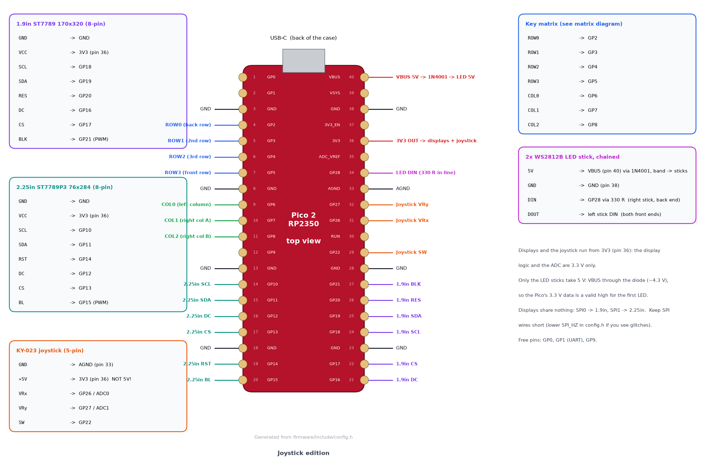
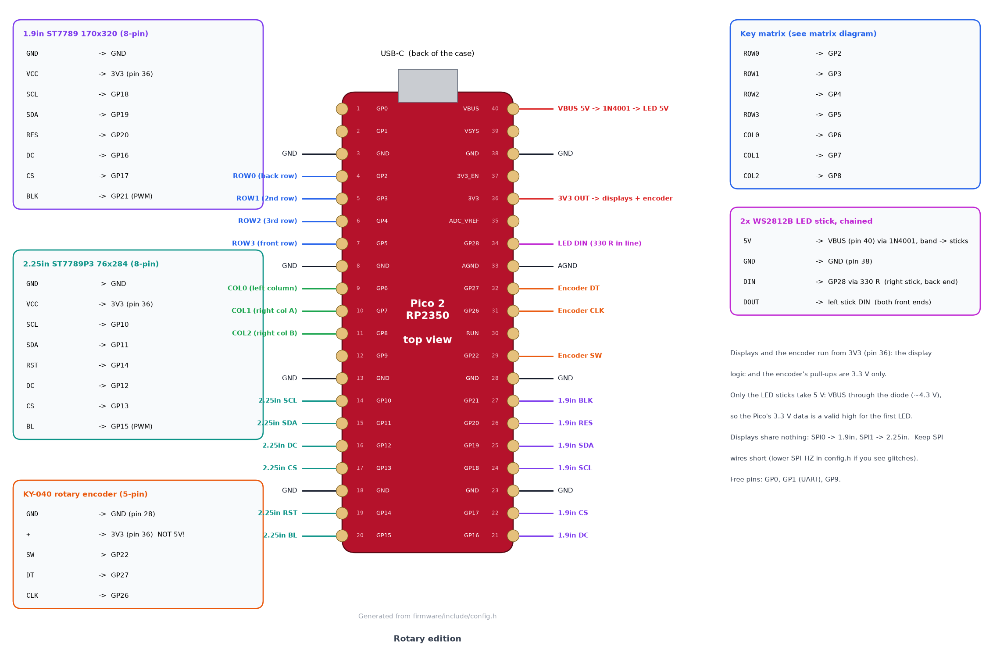

# Wiring

The pin map lives in each edition's `config.h`
([joystick](../joystick/firmware/include/config.h), [rotary](../rotary/firmware/include/config.h));
the diagrams below are generated from those files (`make diagrams`), so they always
match. Both editions use the same pins: the rotary encoder takes over the joystick's
three GPIOs, and the RGB LED sticks are fitted in both. How to solder all of it, and
where the wires run inside the case, is in the [soldering guide](soldering.md).

| Joystick edition | Rotary edition |
|---|---|
|  |  |

## Pin map

| Pico pin | GPIO | Connects to |
|---|---|---|
| 4, 5, 6, 7 | GP2, GP3, GP4, GP5 | matrix ROW0 (back) … ROW3 (front) |
| 9, 10, 11 | GP6, GP7, GP8 | matrix COL0 (left column), COL1, COL2 (right block) |
| 14 | GP10 | 2.25" SCL (SPI1 SCK) |
| 15 | GP11 | 2.25" SDA (SPI1 TX) |
| 16 | GP12 | 2.25" DC |
| 17 | GP13 | 2.25" CS |
| 19 | GP14 | 2.25" RST |
| 20 | GP15 | 2.25" BL (PWM backlight) |
| 21 | GP16 | 1.9" DC |
| 22 | GP17 | 1.9" CS |
| 24 | GP18 | 1.9" SCL (SPI0 SCK) |
| 25 | GP19 | 1.9" SDA (SPI0 TX) |
| 26 | GP20 | 1.9" RES |
| 27 | GP21 | 1.9" BLK (PWM backlight) |
| 28 | GND | encoder GND |
| 29 | GP22 | joystick SW · encoder SW |
| 31 | GP26 / ADC0 | joystick VRx · encoder CLK |
| 32 | GP27 / ADC1 | joystick VRy · encoder DT |
| 33 | AGND | joystick GND |
| 34 | GP28 | LED sticks DIN (through 330 Ω) |
| 36 | 3V3 | VCC of both displays, joystick "+5V" / encoder "+" |
| 38 | GND | LED sticks GND |
| 40 | VBUS | LED sticks 5V (through a 1N4001) |
| 3, 8, 13, 18, 23 | GND | display GNDs |

Free for later: GP0/GP1 (UART), GP9.

**Power notes**
- The displays and the joystick or encoder run from the Pico's **3V3** regulator
  (≈300 mA available; the two backlights and the logic draw well under 100 mA). Do
  **not** feed them from VBUS/VSYS: the 1.9" module passes VCC straight to the panel,
  the joystick's outputs must stay below 3.3 V for the ADC, and the KY-040's pull-up
  resistors go to its "+" pin, so 5 V there would reach the GPIOs.
- Only the LED sticks take 5 V, from VBUS through a diode (see below).
- Use AGND for the joystick ground; it keeps the analog readings quieter.

## Key matrix


- **COL2ROW**: each switch goes between its column wire and a diode; the diode's cathode
  (black band) goes to the row wire. The firmware drives one row low at a time and reads
  the columns with pull-ups.
- Row wires run across the whole pad: left column → under the centre (between the
  display/centre-control area and the plate) → the two right columns. Column wires run
  front to back.
- Physical order: ROW0 = back row (next to the USB port), COL0 = the single column
  next to the bar display. The keymaps (`<edition>/firmware/src/keymap.cpp`) use the
  same numbering.
- Step by step, with pictures: [soldering guide, steps 1–4](soldering.md#step-1--diodes-on-the-switches).

## Display modules

| Module pin | 1.9" (SPI0) | 2.25" (SPI1) |
|---|---|---|
| GND | GND | GND |
| VCC | 3V3 | 3V3 |
| SCL | GP18 | GP10 |
| SDA | GP19 | GP11 |
| RES / RST | GP20 | GP14 |
| DC | GP16 | GP12 |
| CS | GP17 | GP13 |
| BLK / BL | GP21 | GP15 |

Each display has its own SPI peripheral, so a wiring problem on one never affects the
other. Keep the SPI wires reasonably short (the Pico sits right under the 1.9" display).
`SPI_HZ` in `config.h` defaults to 40 MHz, which is safe for hand-wired leads; try
62.5 MHz for a faster refresh, or 20 MHz if you ever see garbled pixels.

## Joystick (KY-023), joystick edition

| Module pin | Pico |
|---|---|
| GND | AGND (pin 33) |
| +5V | **3V3** (pin 36) |
| VRx | GP26 (ADC0) |
| VRy | GP27 (ADC1) |
| SW | GP22 (internal pull-up) |

If the pointer moves the wrong way, flip `JOY_INVERT_X` / `JOY_INVERT_Y` (or
`JOY_SWAP_XY`) in `config.h`. The centre is re-sampled at every power-up (keep the stick
still while plugging in) and can be re-calibrated with the `CAL` key on the FN layer.

## Where the wires run

The physical map, drawn from the CAD model: the plate seen from below (as on your
bench) and the base from above.

| Joystick edition | Rotary edition |
|---|---|
|  |  |

## Rotary encoder (KY-040), rotary edition

| Module pin | Pico |
|---|---|
| GND | GND (pin 28, next to SW) |
| + | **3V3** (pin 36) |
| SW | GP22 (internal pull-up, most modules have no resistor fitted for SW) |
| DT | GP27 |
| CLK | GP26 |

The encoder is read by pin-change interrupts and a decoder that only counts complete
detents, so contact bounce never produces extra steps. If clockwise turns the wrong way,
press **FN + REV** (saved) or set `ENC_REVERSE` in `config.h`. For a half-step encoder
(two steps per click), set `ENC_STEPS_PER_DETENT = 2`.

## RGB LED sticks (both editions)

Two 8-LED WS2812B sticks (CJMCU-2812-8 style) are screwed to posts on the base, one
each side of the Pico, LEDs facing up. They are chained, so they need one data pin:

```
Pico GP28 ──330 Ω──► DIN  right stick (back end, next to the Pico's USB end)
                     DOUT right stick (front end) ──► DIN left stick (front end)
Pico VBUS ──►|── 1N4001 (band towards the sticks) ──► 5V of both sticks
Pico GND  ─────────────────────────────────────────► GND of both sticks
```

- **Why the diode:** a WS2812B on 5 V wants at least 3.5 V for a "high" on DIN, and the
  Pico only drives 3.3 V. The diode drops the LED supply to about 4.3 V, where 3.3 V is a
  clean high. The LEDs work fine at that voltage. A 74AHCT125 level shifter would also
  work, but the diode needs no board.
- **The 330 Ω resistor** sits in the data wire close to the first stick's DIN. It damps
  ringing on the wire and protects the first LED. Heat-shrink it inline.
- **Current:** the firmware caps the sticks at 250 mA (`LED_BUDGET_MA`) and at 160/255
  brightness (`LED_MAX_BRIGHTNESS`), so the whole pad stays well inside a USB 2.0 port's
  500 mA. The LEDs follow the display brightness, dim with it when idle, and go dark
  while the computer sleeps.
- The sticks have their pads on the back at both ends. The posts hold them 3 mm above
  the floor, so there is room for the solder joints and the wires under the ends.
- No sticks fitted? Set `LED_COUNT = 0` in `config.h`, or just leave GP28 unconnected.
