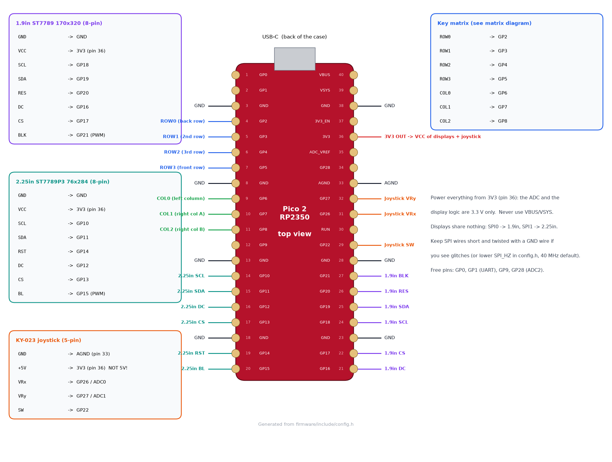

# Wiring

The pin map lives in [`firmware/include/config.h`](../firmware/include/config.h); the
diagrams below are generated from that file (`make diagrams`), so they always match.

## Pin map

| Pico pin | GPIO | Connects to |
|---|---|---|
| 4, 5, 6, 7 | GP2, GP3, GP4, GP5 | matrix ROW0 (back) … ROW3 (front) |
| 9, 10, 11 | GP6, GP7, GP8 | matrix COL0 (left column), COL1, COL2 (right block) |
| 14 | GP10 | 2.25" SCL (SPI1 SCK) |
| 15 | GP11 | 2.25" SDA (SPI1 TX) |
| 16 | GP12 | 2.25" DC |
| 17 | GP13 | 2.25" CS |
| 19 | GP14 | 2.25" RST |
| 20 | GP15 | 2.25" BL (PWM backlight) |
| 21 | GP16 | 1.9" DC |
| 22 | GP17 | 1.9" CS |
| 24 | GP18 | 1.9" SCL (SPI0 SCK) |
| 25 | GP19 | 1.9" SDA (SPI0 TX) |
| 26 | GP20 | 1.9" RES |
| 27 | GP21 | 1.9" BLK (PWM backlight) |
| 29 | GP22 | joystick SW |
| 31 | GP26 / ADC0 | joystick VRx |
| 32 | GP27 / ADC1 | joystick VRy |
| 33 | AGND | joystick GND |
| 36 | 3V3 | VCC of both displays, joystick "+5V" pin |
| 3, 8, 13, 18, 23, 28, 38 | GND | display GNDs |

Free for later: GP0/GP1 (UART), GP9, GP28 (ADC2).

**Power notes**
- Everything runs from the Pico's **3V3** regulator (≈300 mA available; the two
  backlights and the logic draw well under 100 mA). Do **not** feed the displays or the
  joystick from VBUS/VSYS: the 1.9" module passes VCC straight to the panel and pulls
  its backlight input up to VCC, and the joystick's outputs must stay below 3.3 V for
  the ADC.
- Use AGND for the joystick ground; it keeps the analog readings quieter.

## Key matrix

- **COL2ROW**: each switch goes between its column wire and a diode; the diode's cathode
  (black band) goes to the row wire. The firmware drives one row low at a time and reads
  the columns with pull-ups.
- Row wires run across the whole pad: left column → under the centre (between the
  display/joystick area and the plate) → the two right columns. Column wires run front to back.
- Physical order: ROW0 = back row (next to the USB port), COL0 = the single column
  next to the bar display. The keymap in `firmware/src/core/keymap.cpp` uses the same
  numbering.

## Display modules

| Module pin | 1.9" (SPI0) | 2.25" (SPI1) |
|---|---|---|
| GND | GND | GND |
| VCC | 3V3 | 3V3 |
| SCL | GP18 | GP10 |
| SDA | GP19 | GP11 |
| RES / RST | GP20 | GP14 |
| DC | GP16 | GP12 |
| CS | GP17 | GP13 |
| BLK / BL | GP21 | GP15 |

Each display has its own SPI peripheral, so a wiring problem on one never affects the
other. Keep the SPI wires reasonably short (the Pico sits right under the 1.9" display).
`SPI_HZ` in `config.h` defaults to 40 MHz, which is safe for hand-wired leads; try
62.5 MHz for a faster refresh, or 20 MHz if you ever see garbled pixels.

## Joystick (KY-023)

| Module pin | Pico |
|---|---|
| GND | AGND (pin 33) |
| +5V | **3V3** (pin 36) |
| VRx | GP26 (ADC0) |
| VRy | GP27 (ADC1) |
| SW | GP22 (internal pull-up) |

If the pointer moves the wrong way, flip `JOY_INVERT_X` / `JOY_INVERT_Y` (or
`JOY_SWAP_XY`) in `config.h`. The centre is re-sampled at every power-up (keep the stick
still while plugging in) and can be re-calibrated with the `CAL` key on the FN layer.
