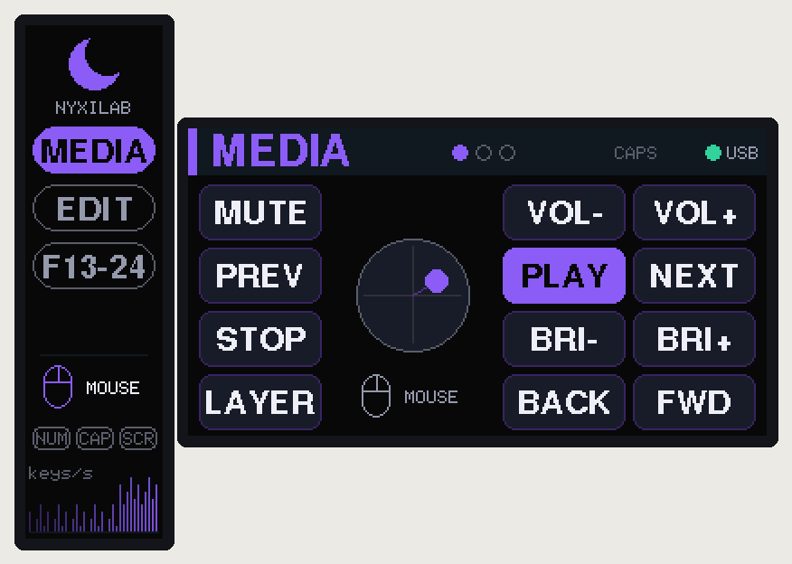

# Firmware

PlatformIO project for the Raspberry Pi Pico 2 (RP2350) and Pico (RP2040), using the
[Arduino-Pico](https://github.com/earlephilhower/arduino-pico) core, Adafruit TinyUSB
(composite HID) and Adafruit GFX / ST7789.



## Build & flash

```bash
pio run                  # Pico 2 (default env)
pio run -e pico          # original Pico / RP2040
pio run -t upload        # flash over USB (reboots the pad into the bootloader itself)
pio device monitor       # serial console, 115200
pio test -e native       # unit tests of src/core on the PC
python3 tools/ui_sim/run.py   # render the UI to ../docs/images/ui/*.png
```

First flash, or if the firmware is broken: hold **BOOTSEL** while plugging the Pico in
and copy `dist/nyxilab-macropad-pico2.uf2` to the `RP2350` drive. Once the case is
closed you do not need BOOTSEL any more:
- `pio run -t upload` resets the pad into the bootloader over USB,
- or hold the **back-left + front-right** keys while plugging in,
- or press **FN + BOOT** (hold the front-left key, press the back-left key).

## Features

- 4×3 hand-wired matrix, COL2ROW, 1 kHz scan, 5 ms per-key debounce
- Composite USB HID: 6-key keyboard + consumer (media) + mouse with wheel and pan
- Layers with momentary / toggle / to / next, tap-hold keys (hold-on-other-key), text macros
- Joystick: mouse, scroll or arrow keys – chosen per layer, cycled with FN + JOY, stick click
  = left click / middle click / Enter; radial dead zone, response curve, auto-learned travel
- Main display (1.9"): layer name, the 12 key labels in their physical layout with live
  press highlight, joystick position and mode, CAPS and USB state
- Bar display (2.25"): layer list, joystick mode, NUM/CAPS/SCROLL LEDs from the host,
  key-press activity graph
- Backlight PWM with FN + DIM±, dims after 1 min idle, off after 10 min or when the host sleeps
- Settings (brightness, per-layer joystick mode, last layer, joystick calibration) stored in flash
- Dual core: input + USB on core 0, rendering on core 1 (off-screen canvases, no flicker)

## Default keymap

Rows are listed back (row 0) to front (row 3); column 0 is the single column next to the bar display.

| Layer | Col 0 | Col 1 | Col 2 | Joystick |
|---|---|---|---|---|
| **MEDIA** | MUTE / PREV / STOP / LAYER | VOL− / PLAY / BRI− / BACK | VOL+ / NEXT / BRI+ / FWD | mouse |
| **EDIT** | UNDO / CUT / FIND / LAYER | REDO / COPY / HOME / ENTER | SAVE / PASTE / END / BKSP | arrows |
| **F13-24** | F13 / F16 / F19 / LAYER | F14 / F17 / F20 / F22 | F15 / F18 / F21 / F23 | scroll |
| **FN** (hold LAYER) | BOOT / JOY / MEDIA / (held) | DIM− / CAL / EDIT / HELLO | DIM+ / SCRN / FKEYS / CAPS | – |

LAYER (front-left key): **tap** = next layer, **hold** = FN. F13–F24 are handy for binding
actions in OBS, IDEs and window managers without clashing with real shortcuts.

## Customising

| What | Where |
|---|---|
| Keys, labels, layers, colours, tap-hold, macros | `src/core/keymap.cpp` |
| Pins, display rotation / inversion / BGR, joystick direction, SPI speed, idle times | `include/config.h` |
| Joystick feel (dead zone, curve, speeds, arrow thresholds) | `JoyConfig` in `src/core/joystick.h` |
| Boot-to-bootloader key combo | `BOOT_COMBO` in `src/core/keymap.h` |

Action helpers for the keymap (`src/core/keycodes.h`):
`K(hid::A)`, `KC(MOD_LCTRL, hid::C)`, `CC(cc::VOL_UP)`, `MB(MB_LEFT)`, `MO(n)`, `TG(n)`,
`TO(n)`, `LNEXT`, `TH(i)`, `MACRO(i)`, `SYS(SYS_BOOTLOADER)`, `JOY(JoyMode::Scroll)`,
`___` (transparent), `XX` (nothing). Shortcuts use Ctrl – on macOS use `MOD_LGUI`.

**Display orientation**: if an image is upside down, change `MAIN_ROTATION` (1 ↔ 3) or
`BAR_ROTATION` (2 ↔ 0). Wrong colours: toggle `*_INVERT`; red/blue swapped: set `*_BGR`.

## Serial console

`pio device monitor` (115200): `help`, `info` (layers, USB, LEDs, calibration),
`joy` (raw stick values for 5 s), `cal` (re-centre), `layer <n>`, `boot`.

## Code layout

```
include/config.h        pins and hardware options
src/core/               pure C++ (no Arduino), unit-tested on the PC
  keycodes.h            action encoding + HID usages
  keymap.h/.cpp         layers (edit me)
  debounce.h            per-key deferred debounce
  engine.h/.cpp         layers, tap-hold, macros -> HID report state
  joystick.h/.cpp       calibration, dead zone, curve, mouse/scroll/arrow modes
src/hw/                 matrix scan, USB HID report scheduler, settings in flash
src/ui/                 UI state hand-over between cores, rendering, ST7789 panels
src/main.cpp            core 0 loop + core 1 display loop
test/test_core/         Unity tests (19) with their own keymap
tools/ui_sim/           builds render.cpp + Adafruit GFX natively and writes PNGs
```
