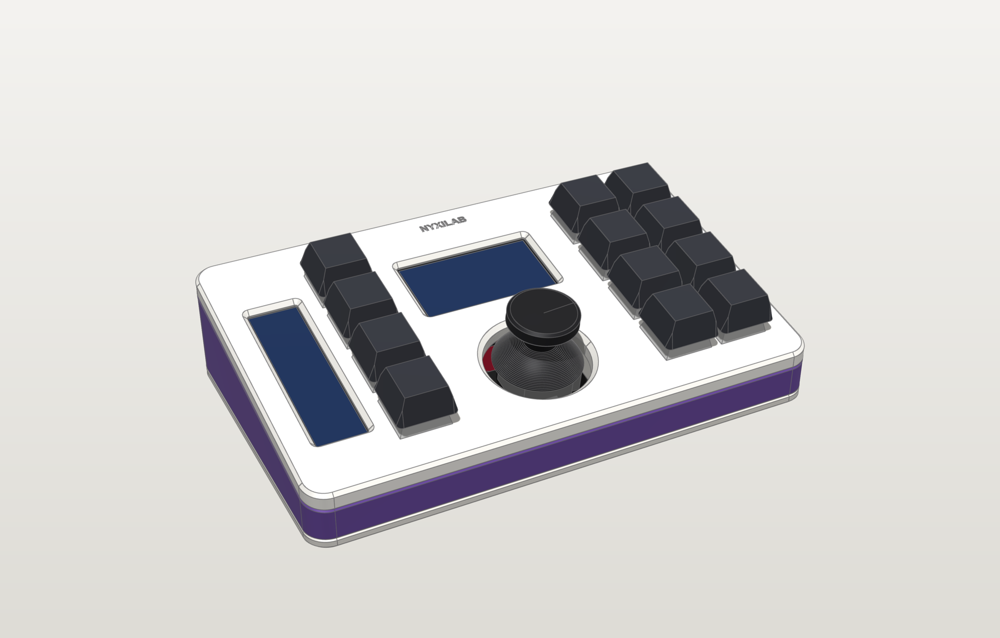

# Joystick edition

The Nyxilab macropad with a **KY-023 thumbstick** in the middle: mouse, scroll or
arrow keys, chosen per layer, and a click.



| | |
|---|---|
| `cad/` | the case of this edition: `edition.py` (the joystick, its posts and opening), `build.py`, and the generated `exports/` (STL, 3MF, STEP, FreeCAD, GLB, blueprints) |
| `firmware/` | the PlatformIO project: `include/config.h` (pins), `src/keymap.cpp` (layers + stick mode per layer), `src/stick.cpp` (the stick as the app's centre control), `src/joystick.cpp` (the stick maths), `test/`, `dist/` (prebuilt UF2) |

The case model itself and the firmware's engine, USB, displays and LEDs are shared
with the rotary edition and live in [`common/`](../common).

## Build

```bash
make cad-joystick                 # checks + exports + renders + blueprints  (python joystick/cad/build.py all)
make firmware-joystick            # Pico 2 UF2 -> joystick/firmware/dist/    (cd joystick/firmware && pio run)
make firmware-joystick-pico       # original Pico (RP2040)
make flash-joystick               # build + upload over USB
make test-joystick                # unit tests of the stick maths on this PC
```

## What is specific to this edition

- **Case**: the stick's dome sweeps wide when tilted, so the module stands on four
  posts that grow out of the **base** (tilted 10°, M3 self-tapping screws), and the
  top plate has a Ø32 bevelled opening. A 1.2 mm relief in the base clears the solder
  joints. Fit checks: 169 pairs, including the dome's full 25° sweep.
- **Firmware**: `STICK(JoyMode::Mouse | Scroll | Arrows | Off)` per layer in
  `keymap.cpp`; FN + JOY cycles the mode of the current layer, FN + CAL re-centres.
  Stick click = left click / middle click / Enter depending on the mode. Calibration
  is learned while you use it and saved in flash.
- **Wiring**: VRx → GP26, VRy → GP27, SW → GP22, +5V → **3V3**, GND → AGND.

## Files to print

`cad/exports/3mf/`: `top_plate`, `frame`, `base`, `bar_spine`, plus the fit-test
coupons in `3mf/fit-tests/` (`fit_plate_joy`, `fit_joystick` are the ones only this
edition has). See [docs/printing.md](../docs/printing.md).

## Docs

[Design](../docs/design.md) · [Printing](../docs/printing.md) · [Soldering](../docs/soldering.md) ·
[Wiring](../docs/wiring.md) · [Assembly](../docs/assembly.md) · [Firmware](../common/firmware/README.md) ·
[CAD](../common/cad/README.md)
