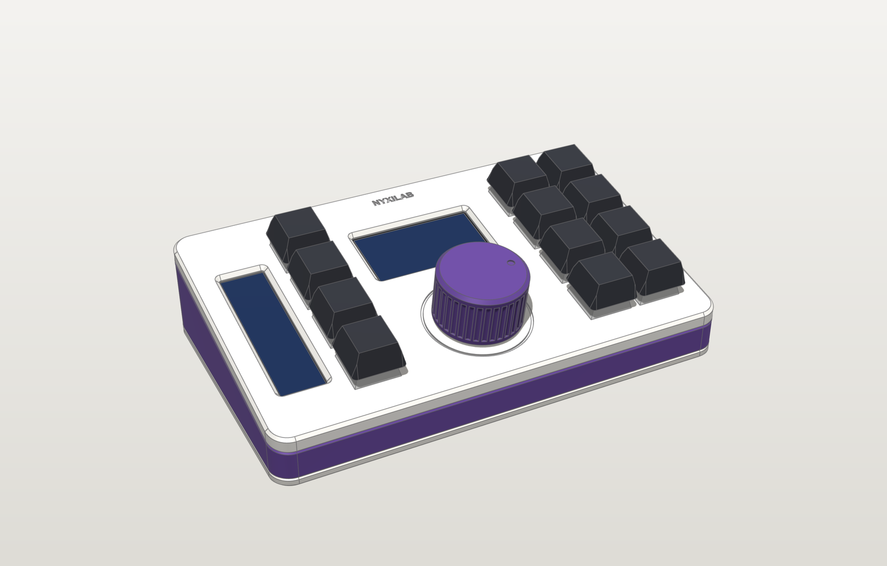

# Rotary edition

The Nyxilab macropad with a **KY-040 rotary encoder** and a printed Ø30 knob in the
middle: volume, undo/redo, scrolling, zoom, per layer, and a click.



| | |
|---|---|
| `cad/` | the case of this edition: `edition.py` (the encoder mount, the knob), `build.py`, and the generated `exports/` (STL, 3MF, STEP, FreeCAD, GLB, blueprints) |
| `firmware/` | the PlatformIO project: `include/config.h` (pins), `src/keymap.cpp` (layers + knob binding per layer + presets), `src/knob.cpp` (the knob as the app's centre control), `src/quad_decoder.h`, `test/`, `dist/` (prebuilt UF2) |

The case model itself and the firmware's engine, USB, displays and LEDs are shared
with the joystick edition and live in [`common/`](../common).

## Build

```bash
make cad-rotary                   # checks + exports + renders + blueprints  (python rotary/cad/build.py all)
make firmware-rotary              # Pico 2 UF2 -> rotary/firmware/dist/      (cd rotary/firmware && pio run)
make firmware-rotary-pico         # original Pico (RP2040)
make flash-rotary                 # build + upload over USB
make test-rotary                  # unit tests of the quadrature decoder on this PC
```

## What is specific to this edition

- **Case**: the encoder is panel-mounted in the **top plate**: its M7 bushing goes up
  through a Ø7.4 hole, the washer and nut clamp a 2 mm section from the top, and a
  12.5 mm square pocket underneath keys the body so it can't turn. The base has no
  posts. The **knob** (Ø30 × 19, 36 flutes, indicator dimple) is a press fit on the
  D-shaft; its bore ends at the shaft tip, so it stops 1 mm above the plate and a push
  goes into the encoder's switch. An engraved ring frames it. Fit checks: 191 pairs,
  including the spinning knob's envelope.
- **Firmware**: `KNOB(cw, ccw, press, "LABEL")` per layer in `keymap.cpp`
  (volume / undo-redo / scroll / screen brightness by default). FN + KNOB cycles the
  current layer through the presets (volume, scroll, zoom, arrows), FN + REV flips
  the direction. Detents are decoded by interrupts and queued, so fast turns lose
  nothing.
- **Wiring**: CLK → GP26, DT → GP27, SW → GP22, + → **3V3**, GND → GND.

## Files to print

`cad/exports/3mf/`: `top_plate`, `frame`, `base`, `bar_spine`, **`knob`** (top face
down, fine layers), plus the fit-test coupons in `3mf/fit-tests/` (`fit_plate_enc` is
the one only this edition has). Print the knob early: it is the best test of the
shaft fit (`Knob.bore_clear` in `cad/edition.py`). See
[docs/printing.md](../docs/printing.md#the-knob-rotary-edition).

## Docs

[Design](../docs/design.md) · [Printing](../docs/printing.md) · [Soldering](../docs/soldering.md) ·
[Wiring](../docs/wiring.md) · [Assembly](../docs/assembly.md) · [Firmware](../common/firmware/README.md) ·
[CAD](../common/cad/README.md)
